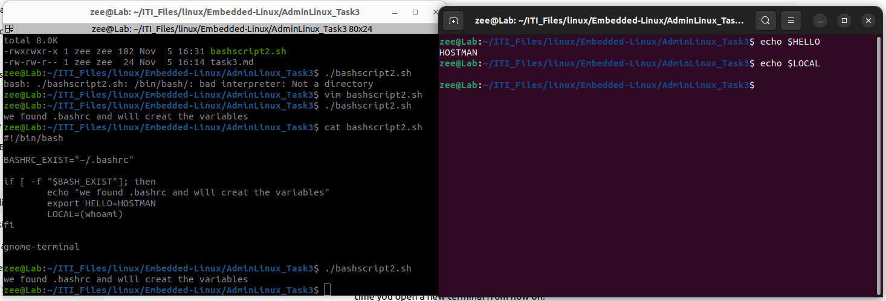
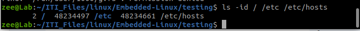
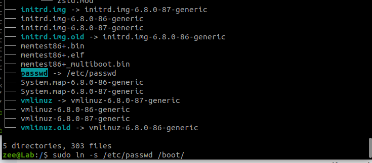

# Task 3

### Section 1

Only the GLOBAL variable was inherated to the new terminal, but the local one don't exist

### Section 2

1. zee@Lab:~$ ls /usr/bin > /tmp/commands.list

   

2. i could not see if it is working or not, but i modified the .profile itself.

   

3. the command is:  

   ​	words in a file: wc -w filename

   ​	number of files in directory: ls directory | wc -l

   a. zee@Lab:~$ cat /etc/passwd | wc -l
   51

4. 0

   a. the second cat overwrite the first one, printing only the second file content.

​	b.  will not work: rm missing operand

​	c. it will count the lines of the file /etc/passwd: which is the number of users on the device

5. i tried without sudo at the beginning, but had to use it to read all the files which need privilege : sudo find / -iname ".profile"

   

6. 

7. sudo ln -s /etc/passwd /boot/

8. 

9. using the enviroment variable PS2 which have the default value of ">"

   and can be changed in the .bachrc to any thing you need by direct assiment:

   PS2=': '
