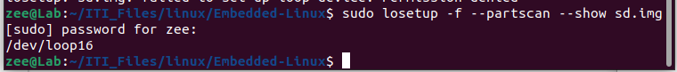
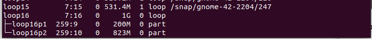
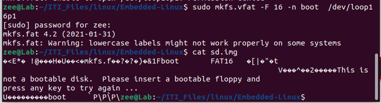
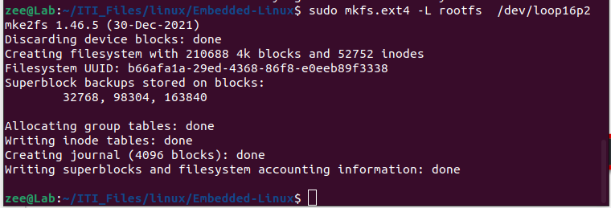

# Virtual SD Card for Emb-Linux

#### Q1: Create a 1 GiB Virtual Disk Image and explain the command you use.

To create the virtual SD card:

1. `touch sd.img`
   Creates an empty file.
2. `dd if=/dev/zero of=/sd.img bs=iM count=1024`
   Runs `/dev/zero` (which continuously outputs zero bytes) and redirects it to the `sd.img` file to fill `1 MB × 1024`.
   This results in a file of approximately 1 GB in size.

------

#### Q2: Define the difference between the DOS/MBR and GPT partition schemes/types.

**GPT (GUID Partition Table)** is the modern standard for disk partitioning:

- Supports drives larger than 2 TB (up to 9.4 ZB)
- Allows more than 128 partitions
- Uses 64-bit disk addressing
- Designed for UEFI (Unified Extensible Firmware Interface), enabling faster and more secure booting

**MBR (Master Boot Record)** is an older, limited standard:

- Restricted to 2 TB
- Supports up to 4 primary partitions
- Uses legacy BIOS booting

------

#### Q3: Define the difference between filesystems and their usage (FAT16, FAT32, EXT4)

### Comparison Summary Table

| Feature             | FAT16                    | FAT32                  | EXT4                |
| ------------------- | ------------------------ | ---------------------- | ------------------- |
| **Max File Size**   | 2 GB (4 GB with LFS)     | 4 GB                   | 16 TB               |
| **Max Volume Size** | 2–4 GB                   | 8–16 TB                | 1 EiB               |
| **Journaling**      | No                       | No                     | Yes                 |
| **Compatibility**   | Extremely High (Legacy)  | Very High (Universal)  | Linux Only (Native) |
| **Performance**     | Low                      | Low/Moderate           | High                |
| **Ideal Use**       | Older Cameras / Embedded | USB/SD Cards (Sharing) | Linux System/Data   |

------

#### Q4: Formatting and Partitioning the Virtual Disk Image.

1. `cfdisk sd.img`

Displays and manipulates the disk partition table.

Steps performed:

- Selected **DOS (MBR)** to create the partition table
- Divided the full memory into two partitions
  - 200M + bootable + FAT16
  - Remaining available space + EXT4


The next image proves that the MBR was written.


------

#### Q5: Define what loop devices are and why Linux uses them.

Loop devices allow a file to be treated as a block device so it can be mounted and managed like a physical disk.

##### a. Command to create a loop device

1. `losetup -f --partscan --show sd.img`

Attaches the virtual disk image as a loop device.



##### b. Command to list all loop devices currently in use.

```
lsblk
```



##### c. Command to detach a (mounted) loop device

`sudo unmount /home/zee/ITI_Files/linux/Embedded-Linux/sd.img` `[mounting point]`

```
losetup -d /dev/loop16
```

------

#### Q6: How can you check the current loop device limit?

------

#### Q7: Can you expand the number of loop devices in Linux?

------

#### Q8: Attach the Virtual Disk Image as a Loop Device.


------

#### Q9: Format the Virtual Disk Image Partitions (Explain the command you use)

##### a. First primary partition (Boot partition → FAT16, label "boot")

1. `sudo mkfs.vfat -F 16 -n boot /dev/loop16p1`



##### b. Second primary partition (ext4, label "rootfs")

1. `sudo mkfs.ext4 -L rootfs /dev/loop16p2`



Other information was written to `sd.img`, which appeared in the terminal after a delay as it was saved to partition 2 in the loop device.


------

##### Q10: Explain what you know about the “mount” and “unmount” Linux commands.

These commands are used with external devices connected to the system.

- **mount** — informs the kernel that the device is available and allows reading, writing, and execution of files.
- **unmount** — informs the kernel to detach the device and ensures that all data is safely written from cache memory.

------

##### Q11: What is the difference between block devices vs character devices?

Block devices store data in blocks and support random access.
Character devices stream data sequentially (such as keyboards or serial ports).

### Comparison Table

| Feature            | Block Device        | Character Device             |
| ------------------ | ------------------- | ---------------------------- |
| **Data Unit**      | Blocks (fixed size) | Characters/Bytes             |
| **Access**         | Random              | Sequential                   |
| **Buffering**      | Yes (Cached)        | No (Raw)                     |
| **Speed**          | Faster              | Slower                       |
| **Examples**       | HDD, SSD, USB Drive | Keyboard, Mouse, Serial Port |
| **`ls -l` prefix** | `b`                 | `c`                          |

------

##### Q12: Create Mount Points and Mount the Virtual Disk Image Partitions.

```
mkdir boot
mount /dev/loop16p1 boot
```