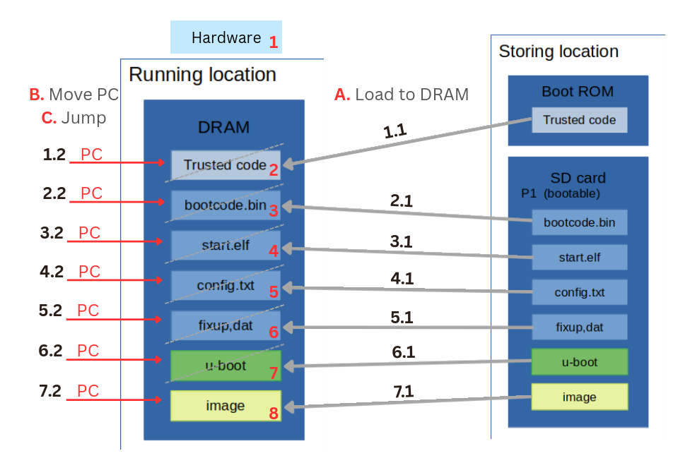
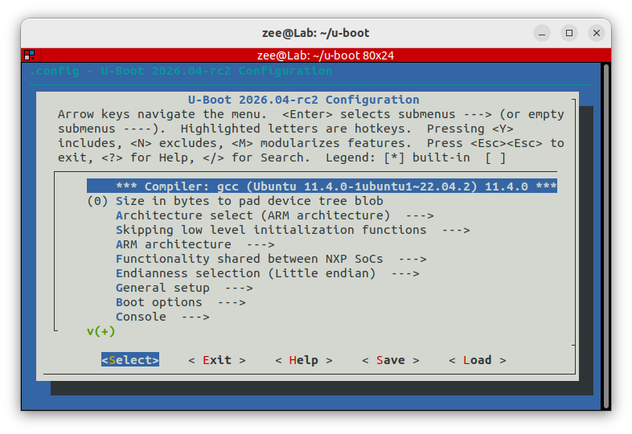
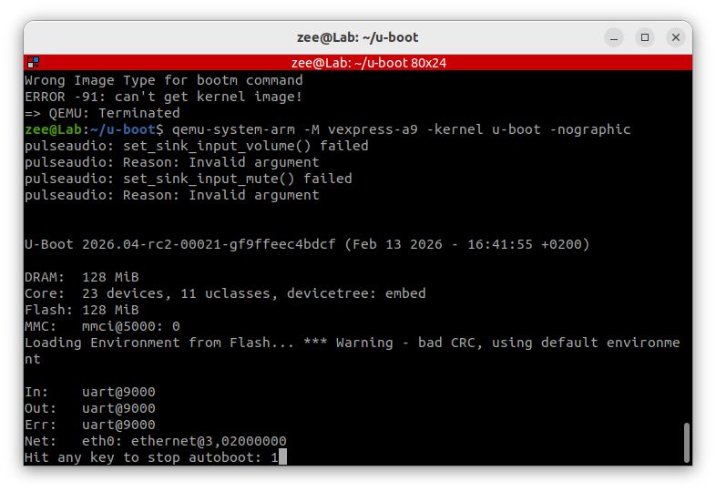
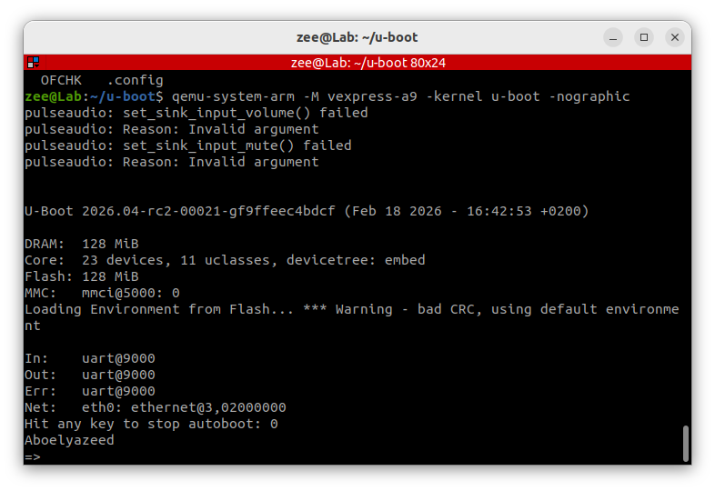

## Building and Customizing U-Boot for QEMU and Raspberry Pi 3B+
### Part A : U-Boot Build and Deployment

#### 1- Define what you Know about the bootloader?

it is an application used to load the desired main APP or main OS on the RAM then jump to its the APP first instruction to start running it.

#### 2- Draw and Explain the exact boot chain on Raspberry Pi from power-on until you see the U-Boot prompt.

**Bounce: ** Draw and Explain the exact boot chain on your PC from power-on until
Running the OS.

#### 3- What is the difference between U-Boot and GRUB ?

**U-Boot** is a universal, low-level bootloader designed for embedded systems and  ARM devices, focusing on hardware initialization and limited resources (used with **Raspberry pi**)

**GRUB** is a flexible, feature-rich bootloader optimized for  PCs, servers, and multi-boot configurations, usually relying on existing firmware (BIOS/UEFI) to function (used with **PC**)

#### 4- What files must be placed in the Raspberry Pi boot partition to boot U-Boot, and define what is the important of each of them?
**bootcode.bin**:  It initializes the SDRAM and prepares the system so that the next firmware stage can run. Without it, the CPU cannot access RAM

**start.elf**: It performs hardware initialization, loads configuration parameters, parses `config.txt`, and loads the next boot component (such as U-Boot or a kernel image) into memory. It effectively orchestrates the boot sequence before control reaches the ARM processor.

**config.txt**:

**fixup.dat**:

**u-boot**:

**dtb**:

**image**:

#### 5- Build and Test Custom U-Boot in QEMU (Cortex-A9):

##### a. Build U-Boot , Customize U-Boot via menuconfig, and Explain the steps you make to configuration.

`cd u-boot/`

​	: go to the folder where you installed U-Boot

`export CROSS_COMPILE=~/x-tools/aarch64-rpi3-linux-gnu/bin/aarch64-rpi3-linux-gnu-`

​	: select your compiler based on the new custom board architecture.

`make menuconfig`

​	: open the U-Boot configuration menu shown below.

​	: change the configurations as you desire, select your board drivers for each peripheral you have  (and if a drive is not found you can write it and add it to the u-boot files then select it from here -memuconfig- again)

`make saveconfig yourNewBoard_config`

​	: save these configurations for future use.

##### b. Run U-Boot in QEMU, and Explain the command you use.

`cd u-boot/`

​	: go to the folder where you installed U-Boot

`export CROSS_COMPILE=arm-linux-gnueabi-`

​	: select the compiler.

`cd configs/`

`ls | grep vex`

​	: to find the exact name for the vexpress (virtual machine) config file 	

`cd ..`

​	: get back to the u-boot folder

`make vexpress_ca9x4_defconfig`	: select the ready vexpress config

`make -j`	: compile the U-Boot with the new selected config

`qemu-system-arm -M vexpress-a9 -kernel u-boot -nographic`	: run QEMU virtual machine and run u-boot on top of it 

​	: load 	QEMU with no graphics

i can change some configirations to make it visable:

​	`make menuconfig`

​	from `Boot options` change `bootcmd value`

​	it was `run distro_bootcmd; run bootflash`    ---> changed to `echo Aboelyazeed` 

​	exit and save menuconfig

​	`make -j`: compile the u-boot

#### 6- Build and Deploy U-Boot on Real Raspberry Pi 3B+ (AArch64)
##### a. Build U-Boot , Customize U-Boot via menuconfig, and Explain the steps you make to configuration.

##### b. Prepare the Virtual SD Card with the Required Files, then Write Image to Physical SD Card