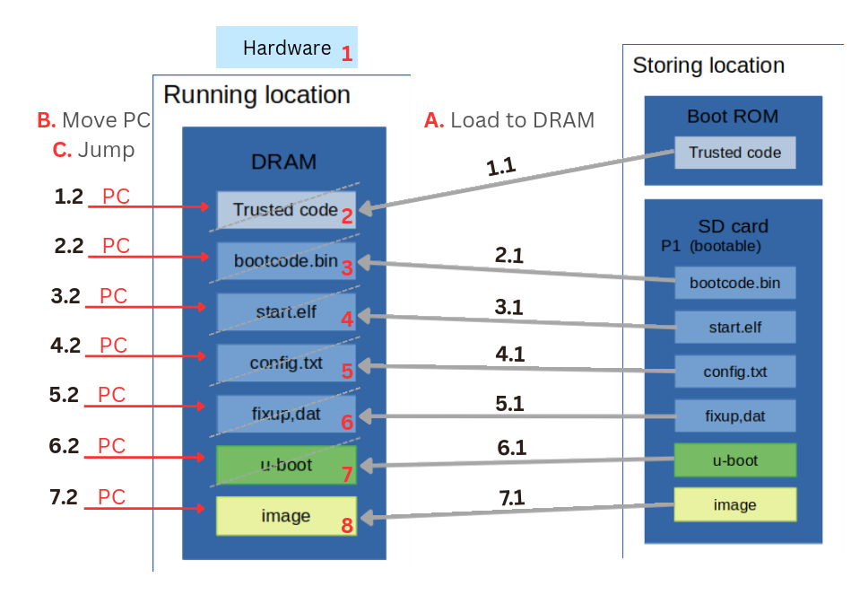
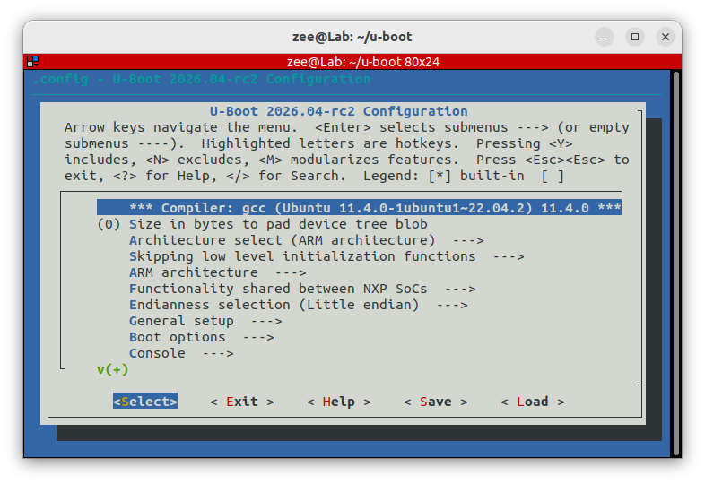
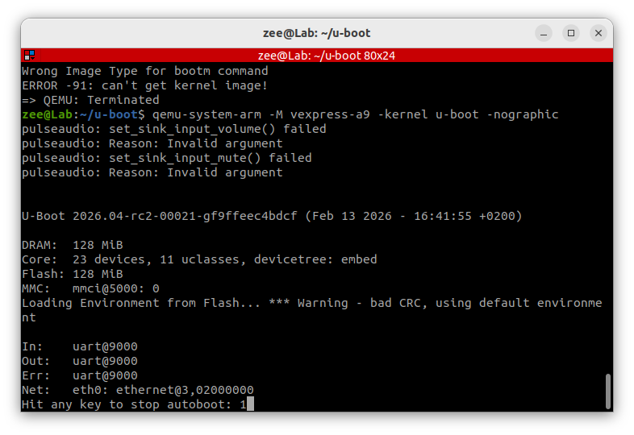
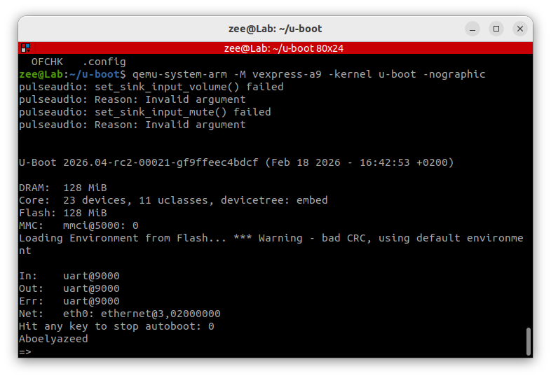
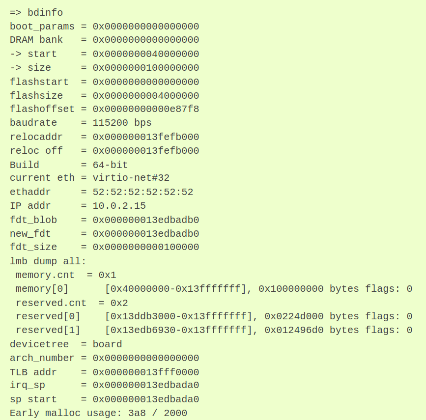
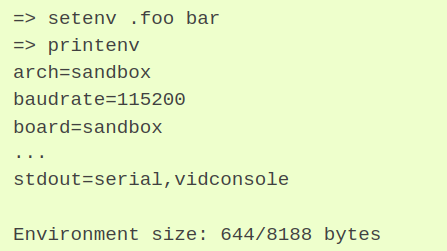

## Building and Customizing U-Boot for QEMU and Raspberry Pi 3B+
### Part A : U-Boot Build and Deployment

#### 1- Define what you Know about the bootloader?

it is an application used to load the desired main APP or main OS on the RAM then jump to its the APP first instruction to start running it.

#### 2- Draw and Explain the exact boot chain on Raspberry Pi from power-on until you see the U-Boot prompt.



**Bounce: ** Draw and Explain the exact boot chain on your PC from power-on until
Running the OS.

#### 3- What is the difference between U-Boot and GRUB ?

**U-Boot** is a universal, low-level bootloader designed for embedded systems and  ARM devices, focusing on hardware initialization and limited resources (used with **Raspberry pi**)

**GRUB** is a flexible, feature-rich bootloader optimized for  PCs, servers, and multi-boot configurations, usually relying on existing firmware (BIOS/UEFI) to function (used with **PC**)

#### 4- What files must be placed in the Raspberry Pi boot partition to boot U-Boot, and define what is the important of each of them?

MOST **PC**s boot on **CPU** then it initialize the GPU, but in **Raspberry Pi** it boots on the **GPU** first then initialize and switch onto CPU.

**bootcode.bin**:  This file is the first-stage GPU bootloader which is loaded from the SD card by the trusted code on the Raspberry Pi’s on-chip ROM (which runs automatically by the hardware).	 It initializes the SDRAM and prepares the system so that the next firmware stage can run. Without it, the CPU cannot access RAM

**start.elf**: This is the main GPU firmware executed after `bootcode.bin`. 	It performs hardware initialization, loads configuration parameters, parses `config.txt`, and loads the next boot component (such as U-Boot or a kernel image) into memory. It effectively orchestrates the boot sequence before control reaches the ARM processor.

**config.txt**: A user-configurable text file read by the GPU firmware that defines boot settings.
 It allows *selection* of the *kernel/bootloader image* ''**U-Boot**'', memory split between CPU and GPU, device-tree selection, UART enabling, and other hardware options. It is essential for directing the firmware to load U-Boot instead of the default Linux kernel.

**fixup.dat**: This file complements `start.elf` by providing memory configuration and relocation data required by the GPU firmware.
 It adjusts memory addresses and ensures proper loading and placement of firmware components depending on the selected hardware configuration.

**u-boot**: This is the second-stage bootloader executed on the ARM **CPU** after firmware initialization.
 U-Boot provides a flexible environment for loading operating systems. It can initialize peripherals, manage boot scripts, load the Linux kernel from storage or network, and pass parameters to the kernel. It replaces the direct kernel boot normally performed by Raspberry Pi firmware.

**dtb**: The DTB file describes the hardware layout of the board to the operating system or bootloader.
 It specifies available peripherals, memory regions, interrupt mappings, and bus configurations. U-Boot and the Linux kernel use this data to correctly configure drivers and hardware interfaces without hardcoding board-specific details (**generic peripherals drivers**).

**image**: This refers to the Linux kernel image (or OS image) loaded by U-Boot.
 After hardware initialization and bootloader execution, U-Boot loads this image into memory and transfers control to it. The image contains the operating system that ultimately runs on the Raspberry Pi.

| Step | Component         | Source → Destination                                    | Loaded By     | Purpose                                              |
| ---- | ----------------- | ------------------------------------------------------- | ------------- | ---------------------------------------------------- |
| 1    | BootROM (GPU)     | On-chip → internal memory (On-chip SRAM inside the SoC) | Hardware      | Executes trusted code, initializes DRAM, starts boot |
| 2    | bootcode.bin      | SD → DRAM                                               | BootROM (GPU) | Initializes SDRAM                                    |
| 3    | start.elf         | SD → DRAM                                               | bootcode.bin  | Main firmware, system init                           |
| 4    | fixup.dat         | SD → DRAM                                               | start.elf     | Memory layout adjustments                            |
| 5    | config.txt        | SD → (parsed)                                           | start.elf     | Boot configuration                                   |
| 6    | DTB (.dtb)        | SD → DRAM                                               | start.elf     | Hardware description                                 |
| 7    | U-Boot / Kernel   | SD → DRAM                                               | start.elf     | Bootloader or OS                                     |
| 8    | ARM CPU start     | DRAM → CPU                                              | GPU           | Transfers execution                                  |
| 9    | U-Boot (optional) | DRAM                                                    | ARM CPU       | Loads kernel + DTB                                   |
| 10   | Linux Image       | SD → DRAM                                               | U-Boot        | Runs OS                                              |

#### 5- Build and Test Custom U-Boot in QEMU (Cortex-A9):

##### a. Build U-Boot , Customize U-Boot via menuconfig, and Explain the steps you make to configuration.

`cd u-boot/`

​	: go to the folder where you installed U-Boot

`export CROSS_COMPILE=~/x-tools/aarch64-rpi3-linux-gnu/bin/aarch64-rpi3-linux-gnu-`

​	: select your compiler based on the new custom board architecture.

`make menuconfig`

​	: open the U-Boot configuration menu shown below.



​	: change the configurations as you desire, select your board drivers for each peripheral you have  (and if a drive is not found you can write it and add it to the u-boot files then select it from here -memuconfig- again)

`make saveconfig yourNewBoard_config`

​	: save these configurations for future use.

##### b. Run U-Boot in QEMU, and Explain the command you use.

`cd u-boot/`

​	: go to the folder where you installed U-Boot

`export CROSS_COMPILE=arm-linux-gnueabi-`

​	: select the compiler.

`cd configs/`

`ls | grep vex`

​	: to find the exact name for the vexpress (virtual machine) config file 	

`cd ..`

​	: get back to the u-boot folder

`make vexpress_ca9x4_defconfig`	: select the ready vexpress config

`make -j`	: compile the U-Boot with the new selected config

`qemu-system-arm -M vexpress-a9 -kernel u-boot -nographic`	: run QEMU virtual machine and run u-boot on top of it 

​	: load 	QEMU with no graphics



i can change some configirations to make it visable:

​	`make menuconfig`

​	from `Boot options` change `bootcmd value`

​	it was `run distro_bootcmd; run bootflash`    ---> changed to `echo Aboelyazeed` 

​	exit and save menuconfig

​	`make -j`: compile the u-boot



#### 6- Build and Deploy U-Boot on Real Raspberry Pi 3B+ (AArch64)
##### a. Build U-Boot , Customize U-Boot via menuconfig, and Explain the steps you make to configuration.

##### b. Prepare the Virtual SD Card with the Required Files, then Write Image to Physical SD Card


#### 7- Which file provides the hardware description to U-Boot on the Raspberry Pi 3B+ and at which stage is it loaded?
the **Device Tree Blob** (DTB) file, and it is loaded by the start.elf code before the U-Boot start executing.

#### 8- After losetup --partscan --show -f sd.img we get devices like /dev/loop5p1 and /dev/loop5p2. Explain how the Linux kernel knows where the partitions start inside the image file.
The kernel reads the first few sectors of `sd.img` to look for a "map" of the disk. It recognizes two main standards:

- **MBR (Master Boot Record):** The kernel looks at the very first 512 bytes. It specifically looks for the "Magic Number" `0x55AA` at the end of the sector. Between bytes 446 and 510, it finds 4 entries that define the **Starting LBA (Logical Block Address)** and the **Size** of each partition.
- **GPT (GUID Partition Table):** If the kernel sees a "Protective MBR," it looks at the second sector (LBA 1) for a GPT Header. This points to a larger table (the Partition Entry Array) which contains exact start and end sectors for up to 128 partitions.


### Part B : U-Boot Commands Environment

####  1.“bdinfo” command is used for:

prints information about the board.



#### 2. “printenv” command is used for:

print environment or UEFI variables.



#### 3. DRAM start address

On a Raspberry Pi (especially RPi 3 and 4), the physical DRAM usually starts at **`0x00000000`**. However, the first few megabytes are often reserved for the GPU or ARM stub code. You can find the exact available DRAM banks by running the `bdinfo` command 

#### 4. How to List and Load Files from a FAT Partition?

- **To List Files:** `fatls mmc 0:1` (Lists files on the first partition of the SD card).
- **To Load a File:** `fatload mmc 0:1 ${kernel_addr_r} Image` (Loads the file `Image` into RAM at the address stored in the `kernel_addr_r` variable).

#### 5. Make the U-Boot banner say “Welcome to Our-Boot – Intake 46”

To change the banner, you must modify the U-Boot source code before compiling.

1. Open the file `include/version_string.h` or search for `CONFIG_IDENT_STRING` in your board's configuration file (e.g., `include/configs/rpi.h`).
2. Alternatively, in modern U-Boot, you can go to `make menuconfig` -> **General Setup** -> **Custom Display Version String** and enter your text there.

### 

#### 6. Add a custom command `hello` that prints your name

This requires adding a C function in the U-Boot source (typically in `common/` or a new file).

C

```
#include <common.h>
#include <command.h>

static int do_hello(struct cmd_tbl *cmdtp, int flag, int argc, char *const argv[]) {
    printf("My name is [Your Name] - Welcome to Intake 46!\n");
    return 0;
}

U_BOOT_CMD(
    hello, 1, 1, do_hello,
    "Prints my name",
    ""
);
```


#### 7. Network Booting with TFTP

**a. Set Up TFTP Server:** On your laptop (Linux), install `tftpd-hpa`. Place your `Image` and `.dtb` files in `/srv/tftp/`. Ensure the service is running and the laptop has a static IP (e.g., `192.168.1.10`).

**b. Configure Network in U-Boot:**

Bash

```
setenv ipaddr 192.168.1.50      # Pi IP
setenv serverip 192.168.1.10    # Laptop IP
ping ${serverip}               # Test connection
```

**c. Load via TFTP:**

Bash

```
tftp ${kernel_addr_r} Image
tftp ${fdt_addr_r} bcm2710-rpi-3-b.dtb
```


#### 8. What is the difference between `run` and `go` commands?

- **`run`**: Executes a script or a command stored in an **environment variable** (e.g., `run bootcmd`).
- **`go`**: Jumps to a specific **memory address** to execute binary code (like a standalone application or a test program) without preparing the kernel boot environment.

#### 9. What is the purpose of `bootargs` and who reads it?

The `bootargs` variable contains the **Kernel Command Line**. It is passed by U-Boot to the **Linux Kernel** during the boot process. The kernel reads it to determine things like where the root filesystem is (`root=/dev/mmcblk0p2`), the console baud rate (`console=ttyS0,115200`), and log levels.

#### 10. Why do we use 0x62000000 and not 0x60000000 for the kernel address on Raspberry Pi?

We avoid the very beginning of the RAM (like `0x60000000` in some specific memory maps) because the **Spin Tables** or **ARM Stub code** (which handles CPU core wake-up) often reside at the lowest part of the memory. Using a slightly higher offset like `0x62000000` prevents the kernel from overwriting the very code the CPU needs to initialize itself during the early boot phase.