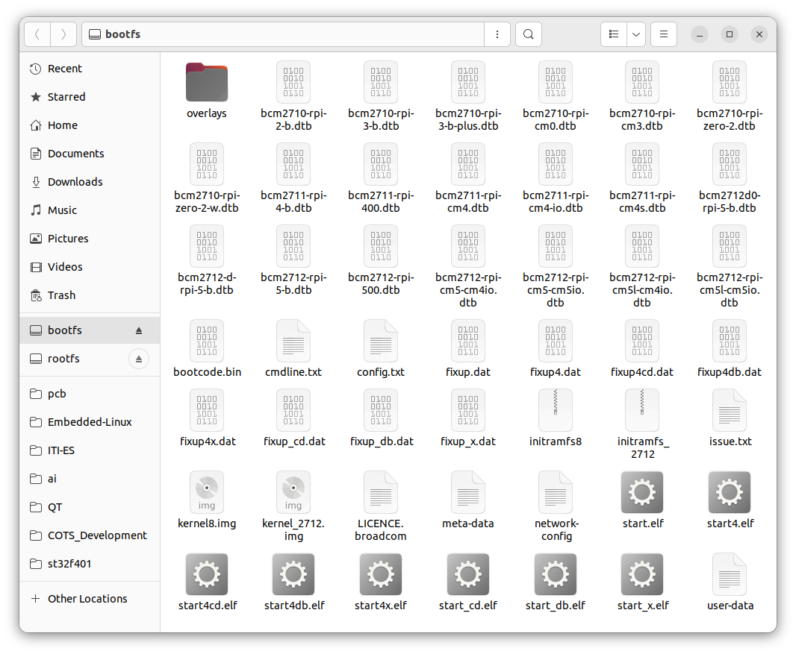
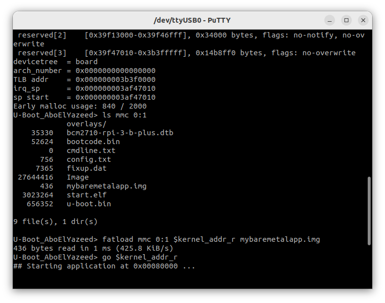
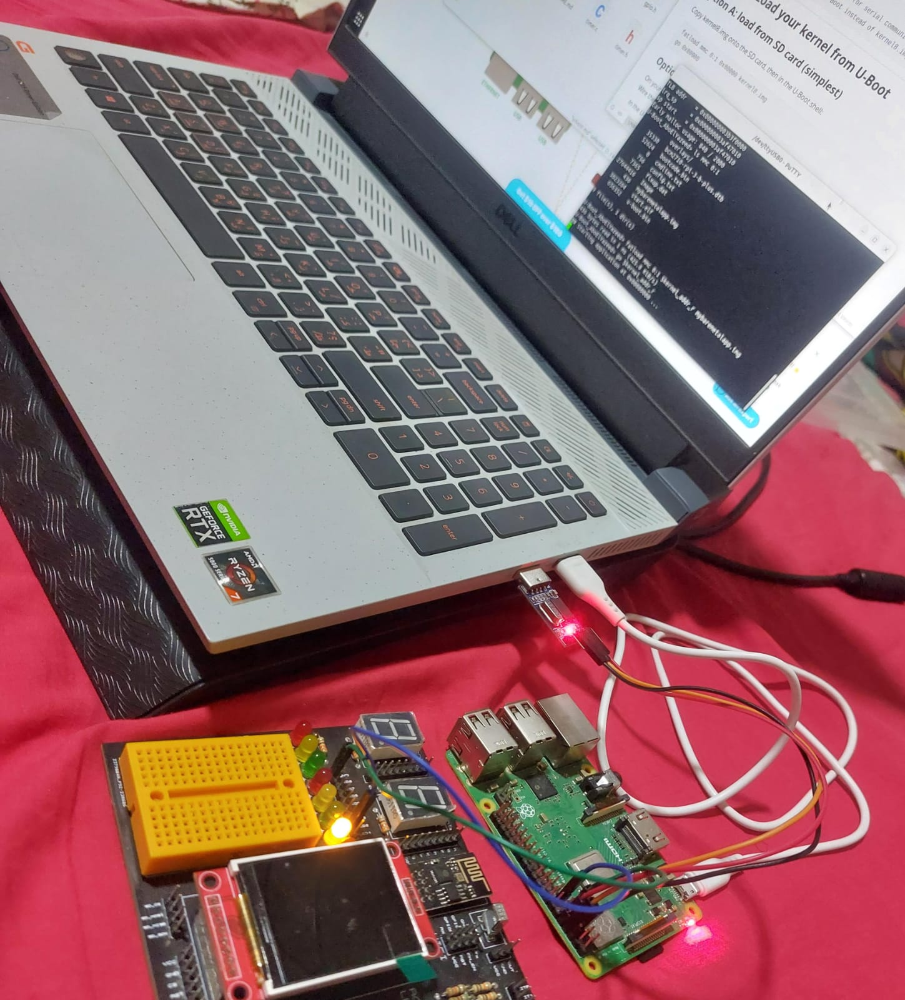

# Raspberry Pi 3B+ Bare Metal LED Blink

#### Bare-Metal Programming with U-Boot : 

##### Loading and Running a Custom Binary from U-Boot

## 1 .  write the application:

Blinks GPIO 27 at 1 Hz with no OS, no libraries, no runtime.

---

## File Overview

​	you must create these files:

​		├── boot.S        # Assembly entry point 

​		├── main.c        # C code 

​		├── linker.ld     # Memory layout 

​		└── Makefile

#### `boot.S` — CPU startup (Assembly)

The very first code the CPU executes at address `0x80000`.

Contains:
- Core parking: cores 1, 2, 3 are sent to a low-power `wfe` halt loop; only core 0 runs
- Stack setup: stack pointer is set to `0x80000` (grows downward into free SDRAM)
- BSS zeroing: loops over the BSS region and writes zeros (required by C standard)
- Jump to `main()`: hands off control to C code

#### `gpio.h` — GPIO register definitions (Header)

Defines the memory-mapped addresses of the BCM2837 GPIO hardware registers.

Contains:
- `MMIO` base address (`0x3F200000` for Pi 3 — different from Pi 4)
- `GPFSEL2` — function select register for pins 20–29
- `GPSET0` / `GPCLR0` — registers to turn a pin HIGH or LOW
- `LED_PIN` — set to **27** for this project
- Function prototypes: `gpio_init()`, `gpio_set()`, `gpio_clr()`

#### `gpio.c` — GPIO driver (Implementation)

Implements the three GPIO functions declared in `gpio.h`.

Contains:
- `gpio_init()` — configures GPIO 27 as an output by writing to `GPFSEL2`
  - Pin 27 occupies bits 23:21 of `GPFSEL2` (formula: `(pin % 10) * 3`)
- `gpio_set()` — writes to `GPSET0` to drive the pin HIGH (LED ON)
- `gpio_clr()` — writes to `GPCLR0` to drive the pin LOW (LED OFF)

#### `timer.h` — Delay function (Header)

Declares the millisecond delay function.

Contains:
- Prototype for `delay_ms(uint32_t ms)`

#### `timer.c` — Delay driver (Implementation)

Uses the BCM2837 free-running system timer for accurate busy-wait delays.

Contains:
- `TIMER_CLO` register at `0x3F003004` — lower 32 bits of the 1 MHz counter
- `delay_ms()` — reads the counter, then spins until `ms × 1000` ticks have passed
- No interrupts needed; works as a simple polling delay

#### `main.c` — Application entry point

The top-level C program. Called by `boot.S` after startup is complete.

Contains:
- Calls `gpio_init()` once to configure the LED pin
- Infinite loop: LED ON → wait 500 ms → LED OFF → wait 500 ms → repeat

#### `linker.ld` — Linker script

Tells the linker exactly where to place each section in memory.

Contains:
- Load address: `. = 0x80000` (where Pi firmware drops the kernel)
- `.text.boot` kept first so `_start` is at exactly `0x80000`
- `.text`, `.rodata`, `.data` sections laid out after boot code
- `__bss_start` / `__bss_end` symbols exported so `boot.S` can zero BSS

#### `CMakeLists.txt` — Build system

CMake build file for cross-compiling on Linux/macOS/Windows.

Contains:
- Toolchain setup: `aarch64-none-elf-gcc` as compiler
- `CMAKE_TRY_COMPILE_TARGET_TYPE = STATIC_LIBRARY` to prevent CMake from trying to run AArch64 test binaries on the host
- Bare metal flags: `-ffreestanding -nostdlib -nostartfiles`
- Links using `linker.ld`
- Post-build step: runs `objcopy` to strip the ELF into a raw `kernel8.img`

---

### `config.txt` — Pi firmware configuration
Read by the Pi GPU bootloader before the CPU starts.

Contains:
- `arm_64bit=1` — boot in AArch64 mode (loads `kernel8.img`)
- `kernel=u-boot.bin` or `kernel=kernel8.img` depending on whether U-Boot is used

---

### `u-boot.md` — U-Boot integration guide
Step-by-step instructions for using U-Boot as a bootloader.

Contains:
- How to build U-Boot for Pi 3B+
- SD card layout with U-Boot
- Three loading methods: SD card, TFTP (network), autoboot
- UART console wiring and terminal setup

---

## 2. Build
```bash
cmake --build build
cmake -S . -B build
```

Output: `mybaremetalapp.img`

---

## 3. Flash

Copy to a FAT32 SD card alongside:
- `bootcode.bin`
- `start.elf`
- `fixup.dat`
- `config.txt`

(Firmware files from: https://github.com/raspberrypi/firmware/tree/master/boot)

### Minimal files needed on bootfs:


#### for example "Rasbian OS bootfs" contains:



---

## Wiring
```
GPIO 27 (pin 13) ── 330Ω ── LED(+)    LED(-) ── GND (pin 14)
```


## Run the program



