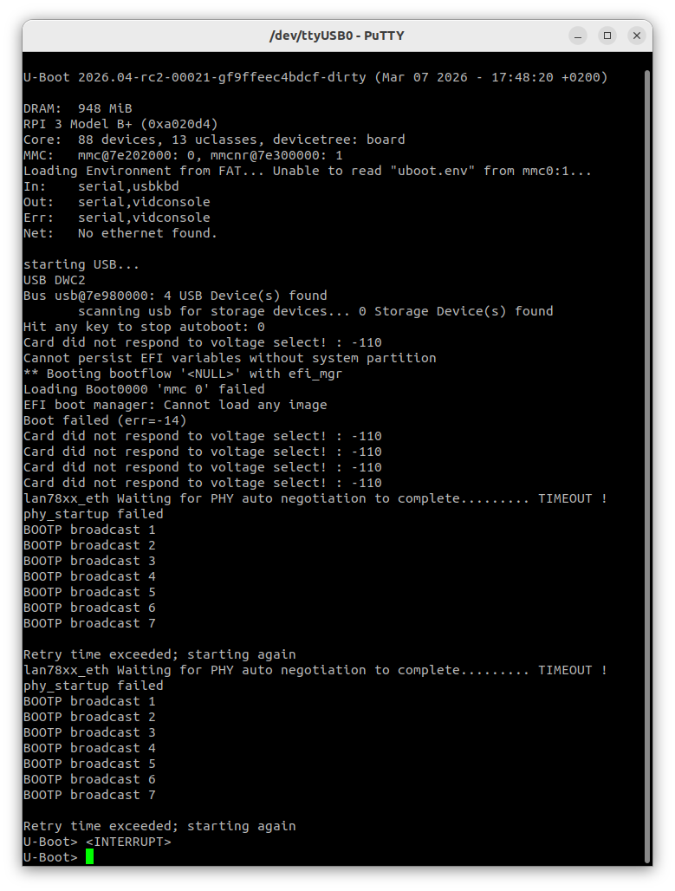

# U-Boot on Raspberry Pi 3B+

## Why U-Boot?
U-Boot sits between the Pi firmware and your bare metal kernel.
It lets you load kernel8.img over UART/USB/TFTP instead of
re-flashing the SD card every time you change your code.

---

## Step 1 — Build U-Boot

    git clone https://github.com/u-boot/u-boot.git
    cd u-boot
    
    # Pi 3B+ 64-bit defconfig
    make rpi_3_b_plus_defconfig \
    				CROSS_COMPILE=~/x-tools/aarch64-rpi3-linux-gnu/bin/aarch64-rpi3-linux-gnu-
    make menuconfig
    make -j$(nproc) CROSS_COMPILE=~/x-tools/aarch64-rpi3-linux-gnu/bin/aarch64-rpi3-linux-gnu-
    
    # Output: u-boot.bin

---

## Step 2 — SD Card layout

    FAT32 partition (boot):
    ├── bootcode.bin       ← Pi GPU first-stage loader
    ├── start.elf          ← Pi GPU firmware
    ├── fixup.dat          ← memory split config
    ├── config.txt         ← tells firmware to load u-boot
    └── u-boot.bin         ← U-Boot binary

config.txt for U-Boot:

    arm_64bit=1
    enable_uart=1		   # enable uart for serial communication
    kernel=u-boot.bin      # load U-Boot instead of kernel8.img

---

## Step 3 — Load your kernel from U-Boot

### Option A: load from SD card (simplest)

Copy kernel8.img onto the SD card, then in the U-Boot shell:

    fatload mmc 0:1 0x80000 kernel8.img
    go 0x80000

### Option B: load over TFTP (fastest for development)

On your host machine run a TFTP server and place kernel8.img in its root.
Wire the Pi ethernet port to your host.

In the U-Boot shell:

    setenv ipaddr    192.168.1.100       # Pi IP
    setenv serverip  192.168.1.1         # host TFTP server IP
    tftp 0x80000 kernel8.img
    go 0x80000

### Option C: autoboot (no manual typing)

In the U-Boot shell, save the boot command so it runs automatically:

    setenv bootcmd 'fatload mmc 0:1 0x80000 kernel8.img; go 0x80000'
    saveenv

---

## U-Boot + UART console

Connect a USB-to-Serial adapter to Pi GPIO pins:

    Pi GPIO 14 (TXD) → adapter RX
    Pi GPIO 15 (RXD) → adapter TX
    Pi GND           → adapter GND

On host:

```shell
# Linux
# PuTTY → Serial → COM port → 115200
putty -serial /dev/ttyUSB0 -sercfg 115200,8,n,1,N
```


### Output logging through USB-TTL

