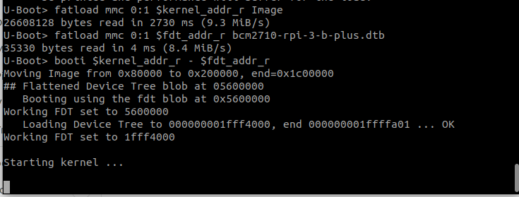
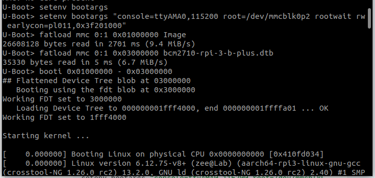
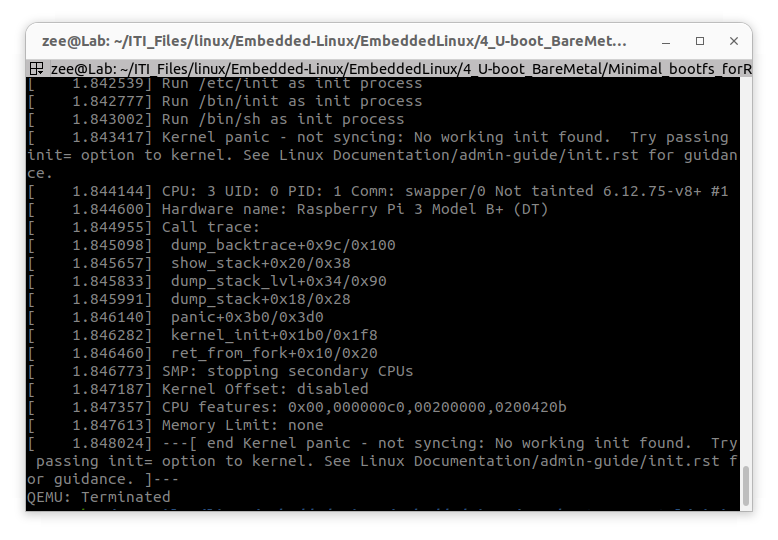
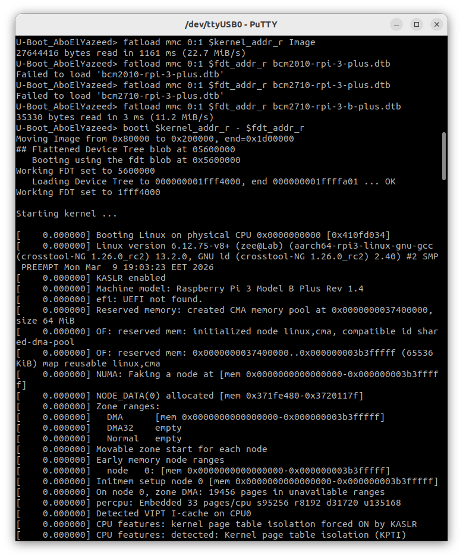
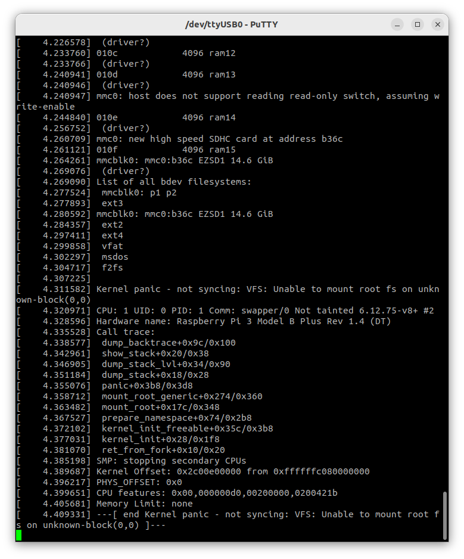
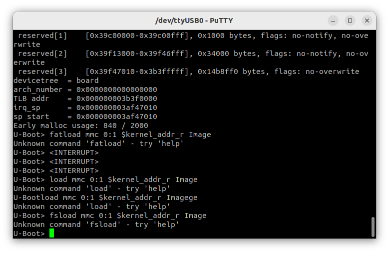
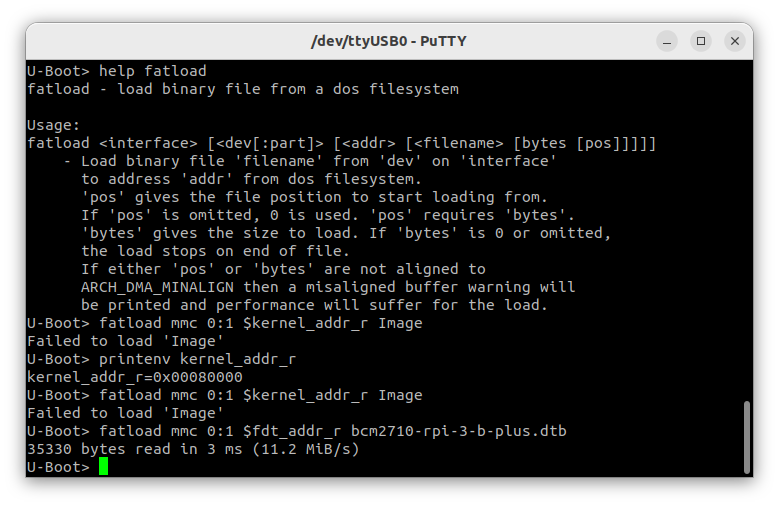
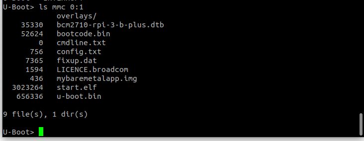
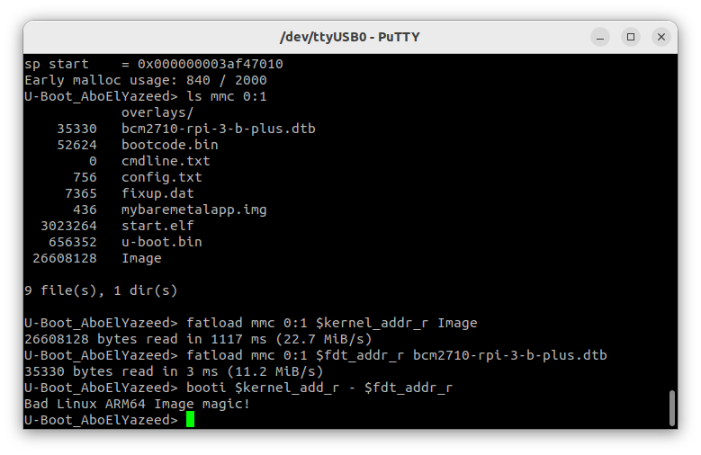
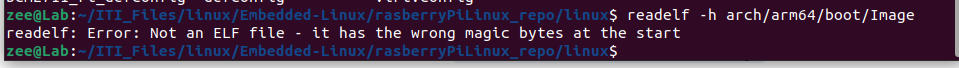

# loading kernel with U-boot

## 1. compile and build u-boot for your target hardware:

```bash
# To go to the folder where you installed U-Boot
cd /home/zee/ITI_Files/linux/Embedded-Linux/u-boot

# To select your compiler based on the new custom board architecture.
export CROSS_COMPILE=~/x-tools/aarch64-rpi3-linux-gnu/bin/aarch64-rpi3-linux-gnu-

# To configure the U-Boot with a ready config file
make rpi_3_b_plus_defconfig

# To open the U-Boot configuration menu to modefy
make menuconfig

# To build the system with the available cores 
# 'nproc' command prints the number of available processing units (CPU cores) on your system
make -j$(nproc)
```


## 2. Compile and build kernel for your target hardware:

## 

```bash
# To go to the folder where you installed rasberryPiLinux_repo
cd /home/zee/ITI_Files/linux/Embedded-Linux/rasberryPiLinux_repo/linux

# To select your compiler based on the board architecture.
export CROSS_COMPILE=~/x-tools/aarch64-rpi3-linux-gnu/bin/aarch64-rpi3-linux-gnu-
# To compile for 64-bit instead of `ARCH=arm` compiles for 32-bit
export ARCH=arm64

# To configure the kernel with a ready config file (it exist in arch/arm64/configs/)
make bcm2711_defconfig

# To open the kernel configuration menu to modefy
make menuconfig

# To build the system with the available cores 
# 'nproc' command prints the number of available processing units (CPU cores) on your system
# This will take time, you will fined the `Image` under arch/arm64/boot/Image
make -j$(nproc)
```


## 3. collect and edit the minimal bootfs files:

## 4. go for QEMU to test your codes

### Simulation on QEMU

1. setup and activate the virtual sd card

2. put the necessery files on the sd card bootfs partition

3. go to the folder on your laptop drive that contains a copy of the virtual sd card

4. run QEMU 

   ```bash
   sudo qemu-system-aarch64 -M raspi3b -m 1024   \              
   						-cpu cortex-a53       \         
   						-kernel u-boot.bin    \               
   						-dtb bcm2710-rpi-3-b-plus.dtb \                  
   						-device usb-kbd 			  \
   						-sd /home/zee/ITI_Files/linux/Embedded-Linux/sd.img \
   						-nographic
   
   ```

   

5. load the kernel onto the RAM and run it:       i had {try 1, try 2}

   ### try1: "kernel stuck but no loggings"

   ```bash
   fatload mmc 0:1 $kernel_addr_r Image 
   
   fatload mmc 0:1 $fdt_addr_r bcm2710-rpi-3-b-plus.dtb 
   
   booti $kernel_addr_r - $fdt_addr_r 
   ```



### try 2: "successful kernel panic (>_<) "

```bash
# 1. Clear any old args
setenv bootargs

# 2. Set the correct console for RPi 3/4 (ttyAMA0 is standard for PL011)
# Add 'earlycon' to see messages even if the full serial driver hasn't loaded yet
setenv bootargs "console=ttyAMA0,115200 root=/dev/mmcblk0p2 rootwait rw earlycon=pl011,0x3f201000"

# 3. Load Kernel higher in RAM (0x1000000 = 16MB offset) 
# This gives the kernel plenty of space to decompress without hitting reserved blocks
fatload mmc 0:1 0x01000000 Image

# 4. Load Device Tree
fatload mmc 0:1 0x03000000 bcm2710-rpi-3-b-plus.dtb

# 5. Boot
booti 0x01000000 - 0x03000000
```



#### QEMU kernel panic "output after loading":



## 5. go for the real hardware

### Raspberry pi Implementation


### output result on PuTTY: "successful kernel panic (>_<) "






i faced this problem:

1. stuck on th GPU initialization "start.elf":

   this most proberly caused by the config.txt file mistake, i had this mistake:

   ```bash
   # I wrote this :
   kernel=u-boot.bin		# define the walkup kernel to be U-boot 
   
   # NOTE: NO comments allowed beside a variable like:
   #	{	kernel=u-boot.bin	# this comment will make a huge problem }
   
   # SOLUTION: do it like this:
   # define the walkup kernel to be U-boot 
   kernel=u-boot.bin
   
   # this also correct:
   # define the walkup kernel to be U-boot 
   	kernel=u-boot.bin
   ```

   

2. Unknown load commands

   solved by: restarting the raspberry pi, i did not update any file to solve it.



3. Failed to load Image, while successfully loading the dtb:



​	moving the kernel address did not work	 *setenv kernel_addr_r 0x01000000*

​	because, it did not see the Image at all:	

​	`ls mmc 0:1`



​	solution:

​	copy the image to the sd card

4. Bad linux ARM64 Image magic!

   means U-Boot reached the memory address where you told it the kernel was, but it didn't find the specific "signature" (magic bytes) that every ARM64 Linux kernel must have in its header.

   



