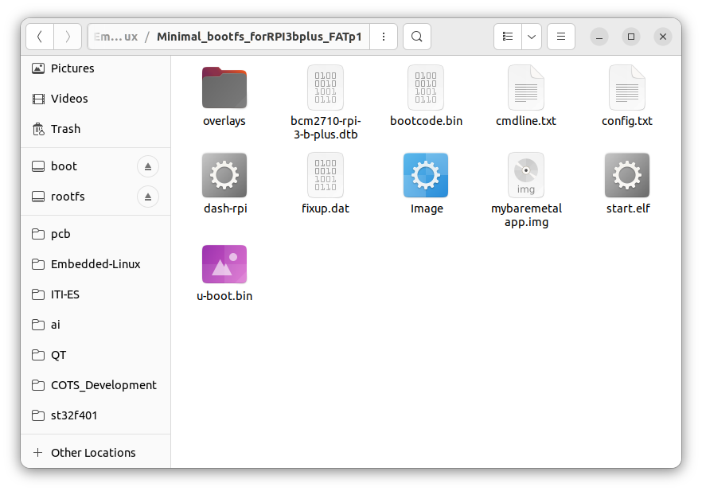
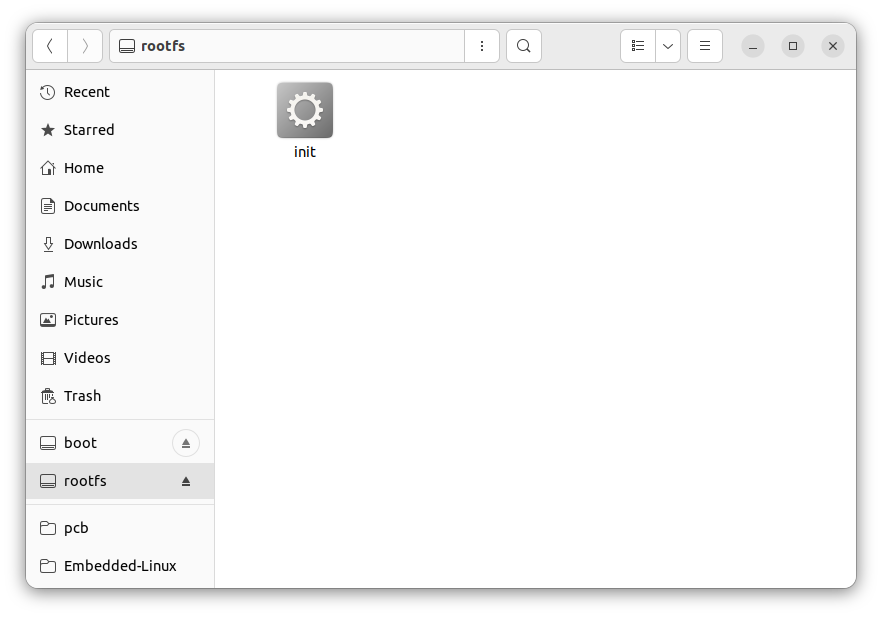
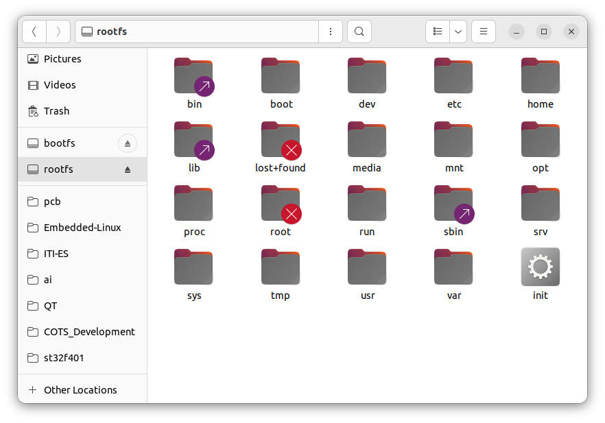
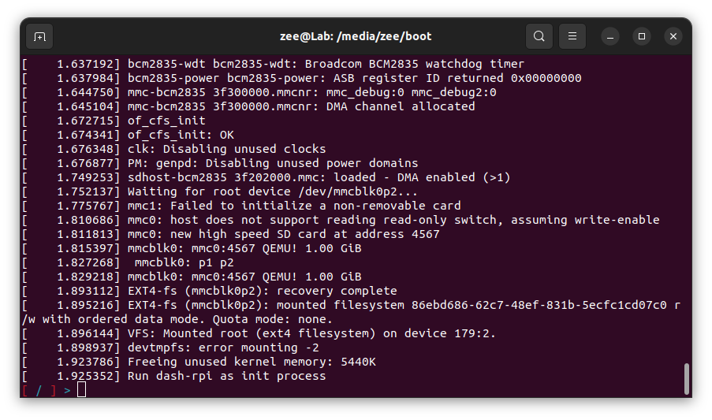
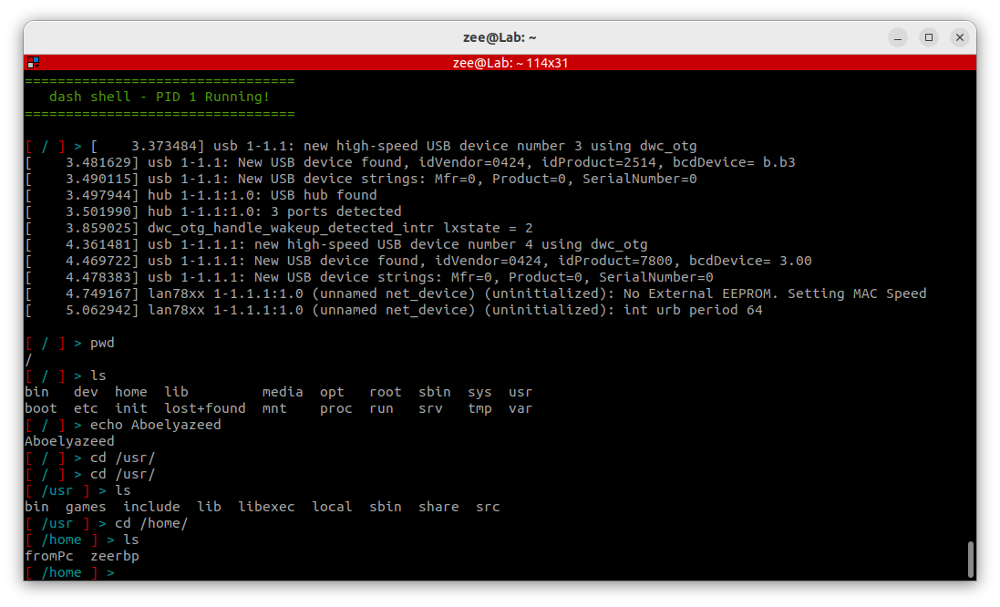
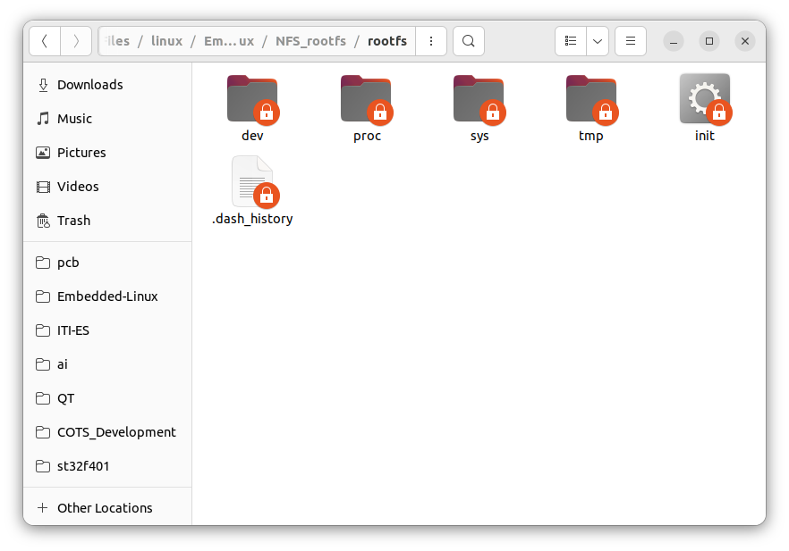
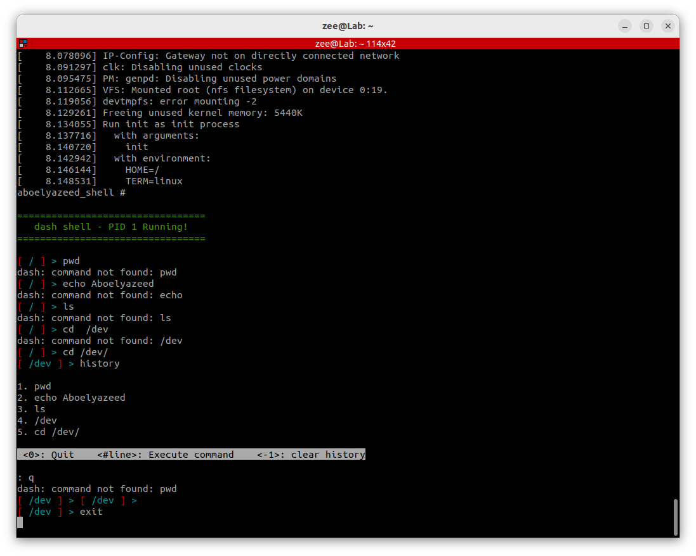

# Loading Kernel & Custom Init Program 'shell' with U-Boot (Remove Kernel Panic)

## Project Description

This project explains how to build and use **U-Boot**, a **Linux kernel**, and a **custom minimal init program** (micro shell) on **Raspberry Pi 3 B+**. It also shows how to test the boot flow using **QEMU** before trying it on the real hardware.

The main goal is to boot the kernel successfully with **U-Boot** and replace the default init process with a custom shell binary, while avoiding boot failures and kernel panic issues. The guide includes:
- building **U-Boot**
- building the **Linux kernel**
- compiling the **micro shell**
- preparing the **bootfs** and **rootfs**
- optional **TFTP** and **NFS** setup
- testing on **QEMU**
- running on the real **Raspberry Pi 3 B+**

---

## 1. Build U-Boot for the Target Hardware

### Same as we did with kernel loading:

####   compile and build u-boot for your target hardware:

```bash
# To go to the folder where you installed U-Boot
cd /home/zee/ITI_Files/linux/Embedded-Linux/u-boot

# To select your compiler based on the new custom board architecture.
export CROSS_COMPILE=~/x-tools/aarch64-rpi3-linux-gnu/bin/aarch64-rpi3-linux-gnu-

# To configure the U-Boot with a ready config file
make rpi_3_b_plus_defconfig

# To open the U-Boot configuration menu to modefy
make menuconfig

# To build the system with the available cores 
# 'nproc' command prints the number of available processing units (CPU cores) on your system
make -j$(nproc)
```

---

## 2. Build the Linux Kernel for the Target Hardware

####   Compile and build kernel for your target hardware:

```bash
# To go to the folder where you installed rasberryPiLinux_repo
cd /home/zee/ITI_Files/linux/Embedded-Linux/rasberryPiLinux_repo/linux

# To select your compiler based on the board architecture.
export CROSS_COMPILE=~/x-tools/aarch64-rpi3-linux-gnu/bin/aarch64-rpi3-linux-gnu-
# To compile for 64-bit instead of `ARCH=arm` compiles for 32-bit
export ARCH=arm64

# To configure the kernel with a ready config file (it exist in arch/arm64/configs/)
make bcm2711_defconfig

# To open the kernel configuration menu to modefy
make menuconfig

# To build the system with the available cores 
# 'nproc' command prints the number of available processing units (CPU cores) on your system
# This will take time, you will fined the `Image` under arch/arm64/boot/Image
make -j$(nproc)
```

---

## 3. Build the Custom Init Program

####   compile the micro shell

This shell will later be copied as the `init` program and executed by the kernel during boot.

```bash
cd ~/ITI_Files/linux/Embedded-Linux/microUnixShell_dash/dash/
make rpi
sudo chmod +x dash-rpi
```

---

## 4. Prepare the Minimal bootfs Files

####   collect and edit the minimal bootfs files:

Copy the kernel image and U-Boot binary into the boot partition files directory.

```bash
sudo cp ~/ITI_Files/linux/Embedded-Linux/rasberryPiLinux_repo/linux/arch/arm64/boot/Image ~/ITI_Files/linux/Embedded-Linux/EmbeddedLinux/Minimal_bootfs_forRPI3bplus_FATp1/

sudo cp ~/ITI_Files/linux/Embedded-Linux/u-boot/u-boot.bin ~/ITI_Files/linux/Embedded-Linux/EmbeddedLinux/Minimal_bootfs_forRPI3bplus_FATp1/
```



---

## 5. Optional Network Services Setup

These services are useful if you want to boot or load files over the network.

### 5.1 setup TFTP on PC 'if needed'

```bash
sudo apt install tftpd-hpa
sudo nano /etc/default/tftpd-hpa
```

the file should contain:

```bash
# /etc/default/tftpd-hpa

TFTP_USERNAME="tftp"
TFTP_DIRECTORY="/srv/tftp"
TFTP_ADDRESS=":69"
TFTP_OPTIONS="--secure --create"
```

after connecting the ethernet:

```bash
ifconfig
# copy the ethernet name 'enp3s0'
sudo ip addr add 192.168.1.3/24 dev enp3s0
ifconfig
```

### 5.2 setup NFS on PC 'if needed'

```bash
# Install NFS server
sudo apt install nfs-kernel-server

# Create directory for rootfs
sudo mkdir -p /srv/nfs/rootfs

# Configure NFS exports
sudo nano /etc/exports
```

```basic
# /etc/exports: the access control list for filesystems which may be exported
#               to NFS clients.  See exports(5).
#

/home/zee/ITI_Files/linux/Embedded-Linux/NFS_rootfs/rootfs 192.168.1.5(rw,sync,no_root_squash,no_subtree_check)

# Example for NFSv2 and NFSv3:
# /srv/homes       hostname1(rw,sync,no_subtree_check) hostname2(ro,sync,no_subtree_check)
#
# Example for NFSv4:
# /srv/nfs4        gss/krb5i(rw,sync,fsid=0,crossmnt,no_subtree_check)
# /srv/nfs4/homes  gss/krb5i(rw,sync,no_subtree_check)
#
```

now put the rootfs files on the selected location written on the exports folder: **"/home/zee/ITI_Files/linux/Embedded-Linux/NFS_rootfs/rootfs "**

---

# QEMU Implementation

## 6. Go for QEMU to Test Your Code

###  a. setup and activate the virtual sd card

```bash
cd ~/ITI_Files/linux/Embedded-Linux
sudo losetup -f --partscan --show sd.img
```

`output`

/dev/loop16

```bash
sudo mkfs.vfat -F 16 -n boot /dev/loop16p1
sudo mkfs.ext4 -L rootfs /dev/loop16p2

sudo mount /dev/loop16p1 /media/zee/boot
sudo mount /dev/loop16p2 /media/zee/rootfs
```

`or` 

➡️ 🌟 just use this script {edit sd.img name or location if needed}

```bash
cd ~/ITI_Files/linux/Embedded-Linux/EmbeddedLinux/2_Virtual_SDcard/
./activateVirtualSdCard.sh
```

`[!]` 

To unmount when done, run:

```bash
sudo umount /media/zee/boot /media/zee/rootfs
sudo losetup -d /dev/loop16
```

---

###  b. put the necessery files on the sd card bootfs & rootfs partitions

```bash
sudo cp -rv ~/ITI_Files/linux/Embedded-Linux/EmbeddedLinux/Minimal_bootfs_forRPI3bplus_FATp1/* /media/zee/boot/
```


using sd card connected to the pc:

```bash
sudo cp ~/ITI_Files/linux/Embedded-Linux/microUnixShell_dash/dash/dash-rpi /media/zee/rootfs/init

sudo chmod +x /media/zee/rootfs/init
```

using NFS:

```bash
sudo cp ~/ITI_Files/linux/Embedded-Linux/microUnixShell_dash/dash/dash-rpi /home/zee/ITI_Files/linux/Embedded-Linux/NFS_rootfs/rootfs/init

sudo chmod +x /home/zee/ITI_Files/linux/Embedded-Linux/NFS_rootfs/rootfs/init
```



or if you have any old complete file system 



---

###  c. run QEMU {u-boot} for simulating Raspberry Pi 3 +

without TFTP:

```bash
# you should be in a location containig boot files 
cd ~/ITI_Files/linux/Embedded-Linux/EmbeddedLinux/Minimal_bootfs_forRPI3bplus_FATp1
# or
cd /media/zee/boot

sudo qemu-system-aarch64 \
    -M raspi3b \
    -m 1024 \
    -cpu cortex-a53 \
    -kernel u-boot.bin \
    -dtb bcm2710-rpi-3-b-plus.dtb \
    -device usb-kbd \
    -drive if=sd,format=raw,file=/home/zee/ITI_Files/linux/Embedded-Linux/sd.img \
    -nographic
```

➡️ 🌟 with TFTP:		"not working with QEMU raspberry pi yet"

```bash
cd /media/zee/boot
# using TAP Real IP (host↔guest) External/real    
sudo qemu-system-aarch64 \
    -M raspi3b \
    -m 1024 \
    -cpu cortex-a53 \
    -kernel u-boot.bin \
    -dtb bcm2710-rpi-3-b-plus.dtb \
    -device usb-kbd \
    -drive if=sd,format=raw,file=/home/zee/ITI_Files/linux/Embedded-Linux/sd.img \
    -nic tap,script=/home/zee/ITI_Files/linux/Embedded-Linux/u-boot/ifup.sh \
    -audiodev none,id=none \
    -nographic
```

---

###  d. enable TFTP protocol {to easily copy files from PC to Ram through u-boot}

```bash
# copy what ever you want to load on the ram to NFTP folder
# image:
sudo cp /home/zee/ITI_Files/linux/Embedded-Linux/EmbeddedLinux/Minimal_bootfs_forRPI3bplus_FATp1/Image /srv/tftp/

# ➡️ 🌟 init program --> shell:
sudo cp ~/ITI_Files/linux/Embedded-Linux/microUnixShell_dash/dash/dash-rpi /srv/tftp/init
sudo chmod +x /srv/tftp/init
```

`u-boot commands`

```bash
# Host machine IP (ifup.sh assigned this)
setenv serverip 192.168.1.3

# Guest IP
setenv ipaddr 192.168.1.5

# Save environment
saveenv

# Test
ping 192.168.1.3
```

---

###  e. set the 'bootargs'         'i did not reach the correct one yet'

`u-boot commands`

```bash
setenv bootargs 'console=ttyAMA0,115200 root=/dev/mmcblk0p2 rootwait rw init=init earlycon=pl011,0x3f201000' 

# AK
setenv bootargs "console=ttyS0,115200 8250.nr_uarts=1 loglevel=8 panic=5 rdinit=/init " 
# ai
setenv bootargs 'console=ttyAMA1,115200 root=/dev/mmcblk0p2 rootwait rw init=/init earlycon=pl011,0x3f201000'
```

---

###  f. set the 'bootcmd'

`u-boot commands`

```bash
# load form sd card
setenv bootcmd 'fatload mmc 0:1 ${kernel_addr_r} Image; fatload mmc 0:1 ${fdt_addr_r} bcm2710-rpi-3-b-plus.dtb; booti ${kernel_addr_r} - ${fdt_addr_r}'
```

```bash
# load form TFTP
setenv bootcmd 'tftp ${kernel_addr_r} Image; tftp ${fdt_addr_r} bcm2710-rpi-3-b-plus.dtb; booti ${kernel_addr_r} - ${fdt_addr_r}'
```

`[or]`

```bash
# to load every time and wait on the u-boot untill "run booot"
setenv bootcmd 'tftp ${kernel_addr_r} Image; tftp ${fdt_addr_r} bcm2710-rpi-3-b-plus.dtb'
setenv booot 'booti ${kernel_addr_r} - ${fdt_addr_r}'
####
run booot
```

`[or]` use a bootcmd script

```bash
# Load Kernel
setenv load_kernel 'if tftp ${kernel_addr_r} Image; then echo ">>> Kernel loaded from TFTP <<<"; else echo "!!! TFTP failed for Kernel, loading from SD !!!"; load mmc 0:1 ${kernel_addr_r} Image; echo ">>> Kernel loaded from SD card <<<"; fi; echo "===================="'

# Load DTB
setenv load_dtb 'if tftp ${fdt_addr_r} bcm2710-rpi-3-b-plus.dtb; then echo ">>> DTB loaded from TFTP <<<"; else echo "!!! TFTP failed for DTB, loading from SD !!!"; load mmc 0:1 ${fdt_addr_r} bcm2710-rpi-3-b-plus.dtb; echo ">>> DTB loaded from SD card <<<"; fi; echo "===================="'

# Load all
setenv load_all 'run load_kernel; run load_dtb'

# Boot command
setenv bootcmd 'run load_all; booti ${kernel_addr_r} - ${fdt_addr_r}'
# setenv bootcmd 'run load_all'

# Save
saveenv
```

---

###  g. load the kernel onto the RAM and run it:       i had {try 1, try 2}

#### try1: "Shell runs but unable to take keyboard inputs"

```bash
# Load kernel & DTB via TFTP if you need
tftp ${kernel_addr_r} Image
tftp ${fdt_addr_r} bcm2710-rpi-3-b-plus.dtb

# or load from 
fatload mmc 0:1 $kernel_addr_r Image 
fatload mmc 0:1 $fdt_addr_r bcm2710-rpi-3-b-plus.dtb 

booti $kernel_addr_r - $fdt_addr_r 
```



#### try2: " "

---

###  h. QEMU kernel panic "output after loading":

> 

---

# Raspberry pi Implementation

## 7. Go for the Real Hardware

###  a. run the picocom to communicate with U-boot

```bash
picocom -b 115200 /dev/ttyUSB0
```

---

###  b. copy files for TFTP protocol {to easily copy files from PC to Ram through u-boot}

```bash
# copy what ever you want to load on the ram to NFTP folder
# image:
sudo cp /home/zee/ITI_Files/linux/Embedded-Linux/EmbeddedLinux/Minimal_bootfs_forRPI3bplus_FATp1/Image /srv/tftp/

# ➡️ 🌟 init program --> shell:
sudo cp ~/ITI_Files/linux/Embedded-Linux/microUnixShell_dash/dash/dash-rpi /srv/tftp/init
sudo chmod +x /srv/tftp/init
```

`u-boot commands`

```bash
# Host machine IP (ifup.sh assigned this)
setenv serverip 192.168.1.3

# Guest IP
setenv ipaddr 192.168.1.5

# Save environmentS
saveenv

# Test
ping 192.168.1.3
```

---

###  c. set the 'bootargs'

`u-boot commands`

```bash
setenv bootargs "console=ttyS0,115200 8250.nr_uarts=1 loglevel=8 panic=5 root=/dev/mmcblk0p2 rootwait rw init=init" 
```

`[or]` use NFS

```bash
setenv bootargs 'console=ttyS0,115200 8250.nr_uarts=1 loglevel=8 panic=5 root=/dev/nfs rootwait rw init=init nfsroot=192.168.1.3:/home/zee/ITI_Files/linux/Embedded-Linux/NFS_rootfs/rootfs,nfsvers=3,tcp ip=192.168.1.5:192.168.1.3:192.168.1.3:255.255.255.0::eth0:off'
```

---

###  d. set the 'bootcmd'

`u-boot commands`

```bash
# load form sd card
setenv bootcmd 'fatload mmc 0:1 ${kernel_addr_r} Image; fatload mmc 0:1 ${fdt_addr_r} bcm2710-rpi-3-b-plus.dtb; booti ${kernel_addr_r} - ${fdt_addr_r}'
```

```bash
# load form TFTP
setenv bootcmd 'tftp ${kernel_addr_r} Image; tftp ${fdt_addr_r} bcm2710-rpi-3-b-plus.dtb; booti ${kernel_addr_r} - ${fdt_addr_r}'
```

`[or]`

```bash
# to load every time and wait on the u-boot untill "run booot"
setenv bootcmd 'tftp ${kernel_addr_r} Image; tftp ${fdt_addr_r} bcm2710-rpi-3-b-plus.dtb'
setenv booot 'booti ${kernel_addr_r} - ${fdt_addr_r}'
####
run booot
```

`[or]` use a bootcmd script

```bash
# Load Kernel
setenv load_kernel 'if tftp ${kernel_addr_r} Image; then echo ">>> Kernel loaded from TFTP <<<"; else echo "!!! TFTP failed for Kernel, loading from SD !!!"; load mmc 0:1 ${kernel_addr_r} Image; echo ">>> Kernel loaded from SD card <<<"; fi; echo "===================="'

# Load DTB
setenv load_dtb 'if tftp ${fdt_addr_r} bcm2710-rpi-3-b-plus.dtb; then echo ">>> DTB loaded from TFTP <<<"; else echo "!!! TFTP failed for DTB, loading from SD !!!"; load mmc 0:1 ${fdt_addr_r} bcm2710-rpi-3-b-plus.dtb; echo ">>> DTB loaded from SD card <<<"; fi; echo "===================="'

# Load all
setenv load_all 'run load_kernel; run load_dtb'

# Boot command
setenv bootcmd 'run load_all; booti ${kernel_addr_r} - ${fdt_addr_r}'
# setenv bootcmd 'run load_all'

# Save
saveenv
```

---

###  e. output result on "picocom": "successful working micro shell "

This is the successful final result after booting the kernel and running the custom shell as the init process on the real Raspberry Pi.

without external commands.

all the folders shown in the 'ls' command [because i did not remove the rasdepian os rootfs so i can restore it without losing the files]



output using NFS:



successful shell ran as init program with limited command [ "cd", "help", "exit", "history", "grep", "sizeof" ]



---

# Output Summary

##  f. Final Output on Real Hardware

The project successfully boots the Linux kernel using **U-Boot** and launches the custom **micro shell** as the init program.

### Result 1: shell output through `picocom`

without external commands.

all the folders shown in the 'ls' command [because i did not remove the rasdepian os rootfs so i can restore it without losing the files]


### Result 2: output using NFS


### Result 3: successful shell ran as init program with limited command support

Supported commands:
- `cd`
- `help`
- `exit`
- `history`
- `grep`
- `sizeof`


