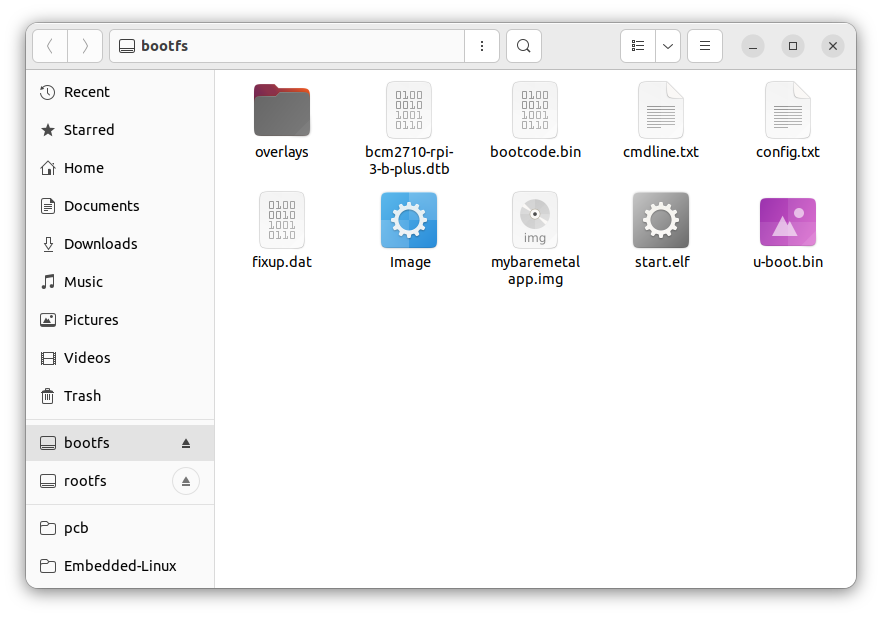
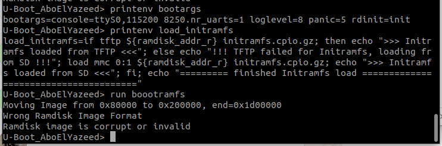
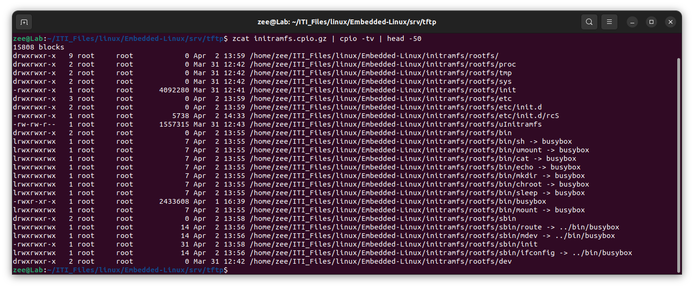
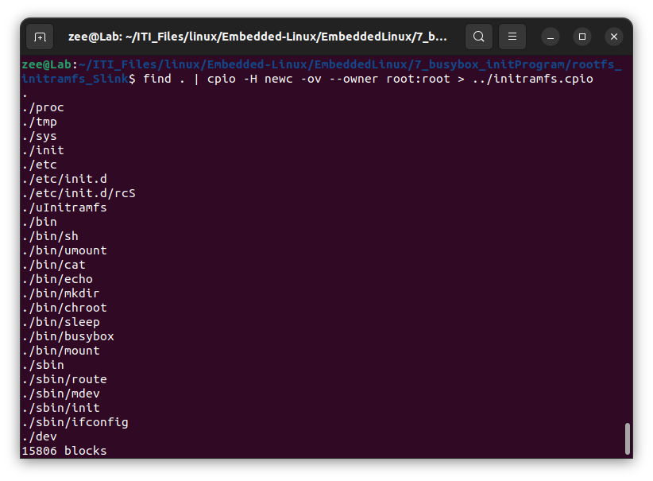
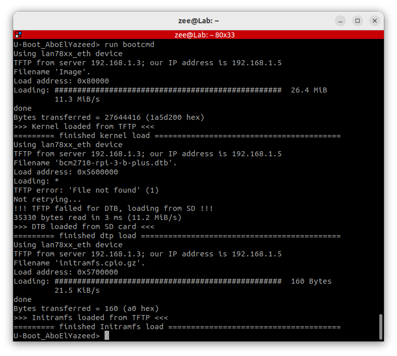
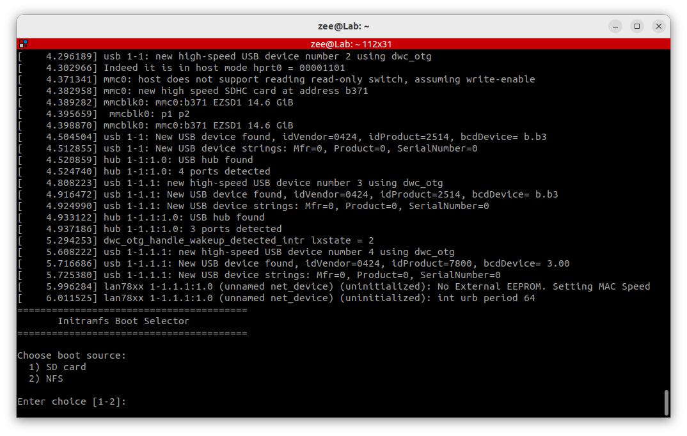
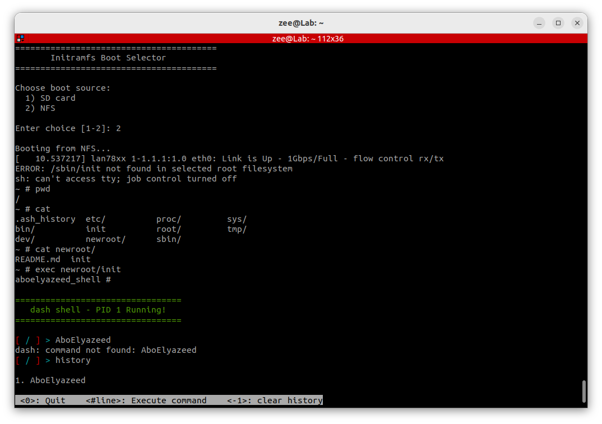
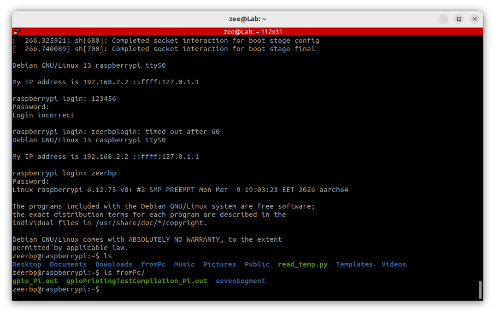

# Loading kernel with 'busybox' init program

## Project Description

This project explains how to boot a **Linux kernel** using **U-Boot** on **Raspberry Pi 3 B+**, while using a **BusyBox-based initramfs** as the early init environment. The BusyBox initramfs provides a small boot-selection layer that allows choosing between booting from the **SD card root filesystem** or an **NFS root filesystem**.

The project also keeps support for using the previously built **micro shell** as an init program inside the selected root filesystem. In this setup, BusyBox is used to provide the minimal userspace tools required during the early boot stage, such as mounting filesystems, handling devices, configuring networking, and switching to the final root filesystem.

This guide includes:
- creating and using symbolic links to simplify working paths
- building **U-Boot**
- building the **Linux kernel**
- building the **micro shell**
- building a **static BusyBox**
- preparing a **BusyBox-based initramfs**
- preparing the **minimal bootfs**
- optional **TFTP** and **NFS** setup
- configuring **bootargs** and **bootcmd**
- booting on real Raspberry Pi hardware
- selecting between **SD card** and **NFS** rootfs at boot time

> Note: Commands were updated only where relative-path usage through the provided symbolic links can preserve the same logic and final result.  
> Script contents were not modified.

---

## Table of Contents

- [Project Description](#project-description)
- [Create symbolic links for your folders](#create-symbolic-links-for-your-folders)
- [1. Build U-Boot for the Target Hardware](#1-build-u-boot-for-the-target-hardware)
  - [1.1 compile and build u-boot for your target hardware](#11-compile-and-build-u-boot-for-your-target-hardware)
- [2. Build the Linux Kernel for the Target Hardware](#2-build-the-linux-kernel-for-the-target-hardware)
  - [2.1 Compile and build kernel for your target hardware](#21-compile-and-build-kernel-for-your-target-hardware)
- [3. Build the Busybox Init Program](#3-build-the-busybox-init-program)
  - [3.1 compile the micro shell](#31-compile-the-micro-shell)
  - [3.2 Build Static BusyBox](#32-build-static-busybox)
  - [3.3 Install BusyBox Binaries](#33-install-busybox-binaries)
  - [3.4 Create Init Script](#34-create-init-script)
  - [3.5 Create Boot Selection Script (rcS)](#35-create-boot-selection-script-rcs)
- [4. Prepare the Minimal bootfs Files](#4-prepare-the-minimal-bootfs-files)
- [5. Optional Network Services Setup](#5-optional-network-services-setup)
  - [5.1 setup TFTP on PC 'if needed'](#51-setup-tftp-on-pc-if-needed)
  - [5.2 setup NFS on PC 'if needed'](#52-setup-nfs-on-pc-if-needed)
- [6. Raspberry pi Implementation](#6-raspberry-pi-implementation)
  - [6.1 run the picocom to communicate with U-boot](#61-run-the-picocom-to-communicate-with-u-boot)
  - [6.2 put the necessary files on the "sd card bootfs" partition](#62-put-the-necessary-files-on-the-sd-card-bootfs-partition)
  - [6.3 put the necessary files on the "rootfs" partition](#63-put-the-necessary-files-on-the-rootfs-partition)
  - [6.4 enable TFTP protocol](#64-enable-tftp-protocol)
  - [6.5 set the 'bootargs'](#65-set-the-bootargs)
  - [6.6 set the 'bootcmd'](#66-set-the-bootcmd)
- [7. Output Summary](#7-output-summary)
  - [7.1 Result 1: the dual boot selective screen](#71-result-1-the-dual-boot-selective-screen)
  - [7.2 Result 2: booting on nfs (containing microshell)](#72-result-2-booting-on-nfs-containing-microshell)
  - [7.3 Result 3: booting on SD card (containing rasdepian os rootfs)](#73-result-3-booting-on-sd-card-containing-rasdepian-os-rootfs)

---

## Create symbolic links for your folders

<details>
<summary>Open section</summary>

These symbolic links simplify path handling and make many commands shorter and easier to reuse.

```bash
ln -s ~/ITI_Files/linux/Embedded-Linux/u-boot u-boot_repo_Slink
ln -s ~/ITI_Files/linux/Embedded-Linux/rasberryPiLinux_repo/linux rpiLinux_repo_Slink
ln -s ~/ITI_Files/linux/Embedded-Linux/microUnixShell_dash/dash/ microShell_repo_Slink
ln -s ~/ITI_Files/linux/Embedded-Linux/busybox busybox_repo_Slink

ln -s ~/ITI_Files/linux/Embedded-Linux/srv/tftp tftp_folder_Slink
ln -s ~/ITI_Files/linux/Embedded-Linux/srv/nfs nfs_folder_Slink
ln -s ~/ITI_Files/linux/Embedded-Linux/initramfs/rootfs/ rootfs_initramfs_Slink
ln -s ~/ITI_Files/linux/Embedded-Linux/EmbeddedLinux/Minimal_bootfs_forRPI3bplus_FATp1/ minBootfs_folder_Slink
```

</details>

---

## 1. Build U-Boot for the Target Hardware

<details>
<summary>Open section</summary>

### Same as we did with kernel loading:

#### 1.1 compile and build u-boot for your target hardware:

```bash
# To go to the folder where you installed U-Boot
cd u-boot_repo_Slink

# To select your compiler based on the new custom board architecture.
export CROSS_COMPILE=~/x-tools/aarch64-rpi3-linux-gnu/bin/aarch64-rpi3-linux-gnu-

# To configure the U-Boot with a ready config file
make rpi_3_b_plus_defconfig

# select bootz from boot commands if needed

# To open the U-Boot configuration menu to modefy
make menuconfig

# To build the system with the available cores 
# 'nproc' command prints the number of available processing units (CPU cores) on your system
make -j$(nproc)
```

</details>

---

## 2. Build the Linux Kernel for the Target Hardware

<details>
<summary>Open section</summary>

#### 2.1 Compile and build kernel for your target hardware:

```bash
# To go to the folder where you installed rasberryPiLinux_repo
cd rpiLinux_repo_Slink

# To select your compiler based on the board architecture.
export CROSS_COMPILE=~/x-tools/aarch64-rpi3-linux-gnu/bin/aarch64-rpi3-linux-gnu-
# To compile for 64-bit instead of `ARCH=arm` compiles for 32-bit
export ARCH=arm64

# To configure the kernel with a ready config file (it exist in arch/arm64/configs/)
make bcm2711_defconfig

# To open the kernel configuration menu to modefy
make menuconfig

# To build the system with the available cores 
# 'nproc' command prints the number of available processing units (CPU cores) on your system
# This will take time, you will fined the `Image` under arch/arm64/boot/Image
make -j$(nproc)
```

</details>

---

## 3. Build the Busybox Init Program

<details>
<summary>Open section</summary>

#### 3.1 compile the micro shell

This shell will later be copied as the `init` program and executed by the kernel during boot.

```bash
cd microShell_repo_Slink
make rpi
sudo chmod +x dash-rpi
```

---

#### 3.2 Build Static BusyBox

Create Initramfs Directory and subdirectories:

```bash
mkdir rootfs_initramfs_Slink
mkdir -p rootfs_initramfs_Slink/bin
mkdir -p rootfs_initramfs_Slink/sbin
```

Navigate to the BusyBox source directory and configure the build environment:

```bash
cd busybox_repo_Slink
export CROSS_COMPILE=~/x-tools/aarch64-rpi3-linux-gnu/bin/aarch64-rpi3-linux-gnu-
export ARCH=arm64
make distclean
make defconfig
```

Configure BusyBox for static linking:

```bash
make menuconfig
```

**In menuconfig, apply the following settings:**

1. Navigate to `Settings` → `Build Options`
2. Enable `[*] Build static binary (no shared libs)`
3. Navigate to `Settings` → `Library Tuning`
4. Disable `[ ] SHA1: Use hardware accelerated instructions if possible`
5. Disable `[ ] SHA256: Use hardware accelerated instructions if possible`

> **Note:** Disabling SHA hardware acceleration is required for ARM64 cross-compilation compatibility.

Build and install BusyBox:

```bash
make -j$(nproc)
make CONFIG_PREFIX=./static_install install
```

#### 3.3 Install BusyBox Binaries

Copy the static BusyBox binary to the initramfs:

```bash
rsync -a --mkpath busybox_repo_Slink/static_install/bin/busybox rootfs_initramfs_Slink/bin/
```

Create symlinks for required commands in `/bin`:

```bash
cd rootfs_initramfs_Slink/bin
ln -sf busybox sh
ln -sf busybox mount
ln -sf busybox umount
ln -sf busybox mkdir
ln -sf busybox echo
ln -sf busybox sleep
ln -sf busybox chroot
ln -sf busybox cat
```

Create symlinks for required commands in `/sbin`:

```bash
cd ../sbin
ln -sf ../bin/busybox mdev
ln -sf ../bin/busybox ifconfig
ln -sf ../bin/busybox route
```

#### 3.4 Create Init Script

Create the init script that executes rcS at boot:

```bash
cat << 'EOF' > rootfs_initramfs_Slink/sbin/init
#!/bin/sh
exec /etc/init.d/rcS
EOF
chmod +x rootfs_initramfs_Slink/sbin/init
```

#### 3.5 Create Boot Selection Script (rcS)

Create the directory structure and the main boot selection script:

```bash
mkdir -p rootfs_initramfs_Slink/etc/init.d
cat << 'EOF' > rootfs_initramfs_Slink/etc/init.d/rcS
#!/bin/sh
# =============================================================================
# Initramfs Boot Selection Script
#
# This script runs as PID 1 from /sbin/init in the initramfs.
# It allows the user to choose between booting from:
#   1) SD card root filesystem
#   2) NFS root filesystem
#
# After mounting the selected root filesystem, it switches to the new root
# using chroot and executes the real /sbin/init.
# =============================================================================

# -----------------------------------------------------------------------------
# Set PATH for BusyBox commands
# -----------------------------------------------------------------------------
PATH=/bin:/sbin
export PATH

# -----------------------------------------------------------------------------
# Configuration Variables
# Modify these values according to your network and storage setup
# -----------------------------------------------------------------------------

# Network interface name (usually eth0 for wired Ethernet)
NET_IF="eth0"

# Static IP address assigned to this board
CLIENT_IP="192.168.1.5"

# Default gateway (router) IP address
GATEWAY="192.168.1.1"

# NFS server IP address
NFS_SERVER="192.168.1.3"

# NFS exported root filesystem path on the server
NFS_PATH="/home/zee/ITI_Files/linux/Embedded-Linux/srv/nfs/"

# SD card root filesystem partition device
SD_ROOT="/dev/mmcblk0p2"

# Temporary mount point for the selected root filesystem
NEWROOT="/newroot"

# -----------------------------------------------------------------------------
# Initial Setup
# Create required directories and mount virtual filesystems
# -----------------------------------------------------------------------------

# Create necessary directories
mkdir -p /proc /sys /dev "$NEWROOT"

# Mount proc filesystem (provides process and kernel information)
mount -t proc proc /proc

# Mount sysfs filesystem (provides kernel and device information)
mount -t sysfs sysfs /sys

# Mount devtmpfs filesystem (provides device nodes automatically)
mount -t devtmpfs devtmpfs /dev

# Populate device nodes using mdev (BusyBox device manager)
mdev -s

# -----------------------------------------------------------------------------
# Boot Menu
# Display options and read user selection
# -----------------------------------------------------------------------------


# Wait a moment for the system to stabilize before showing the menu
sleep 5

echo "========================================"
echo "       Initramfs Boot Selector"
echo "========================================"
echo ""
echo "Choose boot source:"
echo "  1) SD card"
echo "  2) NFS"
echo ""
echo -n "Enter choice [1-2]: "
read choice

# -----------------------------------------------------------------------------
# Option 1: Boot from SD Card
# -----------------------------------------------------------------------------

if [ "$choice" = "1" ]; then
    echo ""
    echo "Booting from SD card..."

    # Wait for SD card to be ready
    sleep 2

    # Mount the SD card root filesystem partition
    mount "$SD_ROOT" "$NEWROOT" || {
        echo "ERROR: Failed to mount SD card rootfs from $SD_ROOT"
        exec sh
    }

# -----------------------------------------------------------------------------
# Option 2: Boot from NFS
# -----------------------------------------------------------------------------

elif [ "$choice" = "2" ]; then
    echo ""
    echo "Booting from NFS..."

    # Configure network interface with static IP address
    ifconfig "$NET_IF" "$CLIENT_IP" up

    # Add default gateway for network routing
    route add default gw "$GATEWAY"

    # Wait for network link to become ready
    sleep 5

    # Mount the NFS exported root filesystem
    # Options:
    #   nolock  - disable NFS file locking (required for some setups)
    #   vers=3  - use NFS version 3
    #   tcp     - use TCP protocol for reliability
    mount -t nfs -o nolock,vers=3,tcp "${NFS_SERVER}:${NFS_PATH}" "$NEWROOT" || {
        echo "ERROR: Failed to mount NFS rootfs from ${NFS_SERVER}:${NFS_PATH}"
        exec sh
    }

# -----------------------------------------------------------------------------
# Invalid Choice
# -----------------------------------------------------------------------------

else
    echo ""
    echo "ERROR: Invalid choice"
    exec sh
fi

# -----------------------------------------------------------------------------
# Verify Root Filesystem
# Check that the selected root filesystem contains /sbin/init
# -----------------------------------------------------------------------------

if [ ! -x "$NEWROOT/sbin/init" ]; then
    echo "ERROR: /sbin/init not found in selected root filesystem"
    exec sh
fi

# -----------------------------------------------------------------------------
# Prepare New Root Filesystem
# Mount virtual filesystems inside the new root before switching
# -----------------------------------------------------------------------------

# Create mount points if they don't exist
mkdir -p "$NEWROOT/dev" "$NEWROOT/proc" "$NEWROOT/sys"

# Mount devtmpfs in new root (provides /dev/console and other device nodes)
mount -t devtmpfs devtmpfs "$NEWROOT/dev" 2>/dev/null

# Mount proc in new root (required by many applications)
mount -t proc proc "$NEWROOT/proc" 2>/dev/null

# Mount sysfs in new root (required by many applications)
mount -t sysfs sysfs "$NEWROOT/sys" 2>/dev/null

# -----------------------------------------------------------------------------
# Switch to New Root Filesystem
# Use chroot to change root directory and execute the real init
# -----------------------------------------------------------------------------

echo ""
echo "Switching to new root filesystem..."
exec chroot "$NEWROOT" /sbin/init
EOF
```

Make the rcS script executable:

```bash
chmod +x rootfs_initramfs_Slink/etc/init.d/rcS
```

</details>

---

## 4. Prepare the Minimal bootfs Files

<details>
<summary>Open section</summary>

#### collect and edit the minimal bootfs files:

Copy the kernel image and U-Boot binary into the boot partition files directory.

```bash
sudo cp rpiLinux_repo_Slink/arch/arm64/boot/Image minBootfs_folder_Slink

sudo cp u-boot_repo_Slink/u-boot.bin minBootfs_folder_Slink
```


</details>

---

## 5. Optional Network Services Setup

<details>
<summary>Open section</summary>

These services are useful if you want to boot or load files over the network on the real hardware.

### 5.1 setup TFTP on PC 'if needed'

```bash
sudo apt install tftpd-hpa
sudo nano /etc/default/tftpd-hpa
sudo mkdir -p tftp_folder_Slink
```

the file should contain:

```bash
# /etc/default/tftpd-hpa

TFTP_USERNAME="tftp"
#TFTP_DIRECTORY="/srv/tftp"
TFTP_DIRECTORY="/home/zee/ITI_Files/linux/Embedded-Linux/srv/tftp"
TFTP_ADDRESS=":69"
TFTP_OPTIONS="--secure --create"
```

after connecting the ethernet:

```bash
ifconfig
# copy the ethernet name 'enp3s0'
sudo ip addr add 192.168.1.3/24 dev enp3s0
ifconfig
```

##### IMPORTANT NOTE:

if you change these configs you must restart the **systemd "tftpd-hpa" service**

```bash
sudo systemctl restart tftpd-hpa 
```

### 5.2 setup NFS on PC 'if needed'

```bash
# Install NFS server once.
sudo apt install nfs-kernel-server

# Create directory for rootfs (sudo: to force using sudo with this location in the future)
sudo mkdir -p nfs_folder_Slink

# Configure NFS exports
sudo nano /etc/exports
```

```basic
# /etc/exports: the access control list for filesystems which may be exported
#               to NFS clients.  See exports(5).
#

/home/zee/ITI_Files/linux/Embedded-Linux/srv/nfs 192.168.1.5(rw,sync,no_root_squash,no_subtree_check)

# /srv/nfs/rootfs  *(rw,sync,no_subtree_check)

# Example for NFSv2 and NFSv3:
# /srv/homes       hostname1(rw,sync,no_subtree_check) hostname2(ro,sync,no_subtree_check)
#
# Example for NFSv4:
# /srv/nfs4        gss/krb5i(rw,sync,fsid=0,crossmnt,no_subtree_check)
# /srv/nfs4/homes  gss/krb5i(rw,sync,no_subtree_check)
# 
```

now put the rootfs files on the selected location written on the exports folder: **"/home/zee/ITI_Files/linux/Embedded-Linux/srv/nfs "**

</details>

---

## 6. Raspberry pi Implementation

<details>
<summary>Open section</summary>

## 6. Go for the Real Hardware

### 6.1 run the picocom to communicate with U-boot

```bash
picocom -b 115200 /dev/ttyUSB0
```

---

### 6.2 put the necessary files on the "sd card bootfs" partition

```bash
sudo cp -rv minBootfs_folder_Slink/* /media/zee/boot/
```



### 6.3 put the necessary files on the "rootfs" partition

using **"sd card"** connected to the pc:

```bash
sudo cp microShell_repo_Slink/dash-rpi /media/zee/rootfs/init

# sudo chmod +x /media/zee/rootfs/init

cp -a busybox_repo_Slink/static_install/bin/busybox rootfs_initramfs_Slink/bin/
```

using **"NFS"**:

```bash
sudo cp microShell_repo_Slink/dash-rpi nfs_folder_Slink/init

# sudo chmod +x ~/ITI_Files/linux/Embedded-Linux/srv/nfs/init
```

using **"Initramfs"**:

```bash
# fill the folder with all the rootfs folders and files:
cp microShell_repo_Slink/dash-rpi rootfs_initramfs_Slink/init
# sudo chmod +x ~/ITI_Files/linux/Embedded-Linux/initramfs/init
```

```bash
# Create the initramfs cpio archive
cd rootfs_initramfs_Slink
find . | cpio -H newc -ov --owner root:root > ../initramfs.cpio

# Compress it (optional but recommended)
# gzip -k ../initramfs.cpio
gzip -k ../initramfs.cpio
# Result: initramfs.cpio.gz

# wrap everything with mkimage:		If using "bootm" (legacy)
# mkimage -A arm64 -T ramdisk -C gzip -n "Initramfs" -d initramfs.cpio.gz uInitramfs
../u-boot_repo_Slink/tools/mkimage -A arm64 -T ramdisk -C gzip -n "Initramfs" -d ../initramfs.cpio.gz ../uInitramfs
```

#### Notes & Warnings:

1. you can not use the **"initramfs.cpio.gz"** directly you must use **"uInitramfs"**
   

2. you must create the initramfs cpio file with relative path to prevent this:  <<<<<< **wrong way** >>>>>>

```
# Create the initramfs cpio archive with {absulute path} <<<<<< wrong >>>>>>
find ~/ITI_Files/linux/Embedded-Linux/initramfs/rootfs/ | cpio -H newc -ov --owner root:root > ~/ITI_Files/linux/Embedded-Linux/initramfs/initramfs.cpio
```



this is the correct one

### 6.4 enable TFTP protocol 

#### to easily copy files from PC to Ram through u-boot

`PC commands`

```bash
# copy what ever you want to load on the ram to TFTP folder
# image:
sudo cp minBootfs_folder_Slink/Image tftp_folder_Slink/

# ➡️ 🌟 init program --> shell:
sudo cp microShell_repo_Slink/dash-rpi tftp_folder_Slink/init
#sudo chmod +x ~/ITI_Files/linux/Embedded-Linux/srv/tftp/init

# ➡️ 🌟 initramfs:
sudo cp ../initramfs.cpio.gz tftp_folder_Slink/
# or 
sudo cp ../uInitramfs tftp_folder_Slink/
```

`u-boot commands`

```bash
# Host machine IP (ifup.sh assigned this)
setenv serverip 192.168.1.3

# Guest IP
setenv ipaddr 192.168.1.5

# Save environment
saveenv

# Test
ping 192.168.1.3
```

---

### 6.5 set the 'bootargs'

`config.txt`

```
[all]
arm_64bit=1
kernel=u-boot.bin
enable_uart=1
```

`u-boot commands`

```bash
setenv bootargs "console=ttyS0,115200 8250.nr_uarts=1 loglevel=8 panic=5 root=/dev/mmcblk0p2 rootwait rw init=init" 
```

`[or]` **use NFS**

```bash
setenv bootargs 'console=ttyS0,115200 8250.nr_uarts=1 loglevel=8 panic=5 root=/dev/nfs rootwait rw init=init nfsroot=192.168.1.3:/home/zee/ITI_Files/linux/Embedded-Linux/srv/nfs,nfsvers=3,tcp ip=192.168.1.5:192.168.1.3:192.168.1.3:255.255.255.0::eth0:off'
```

`[or]` **use initramfs**

```bash
setenv bootargs "console=ttyS0,115200 8250.nr_uarts=1 loglevel=8 panic=5 rdinit=/init " 

setenv bootargs "console=ttyS0,115200 8250.nr_uarts=1 loglevel=8 panic=5 rdinit=/sbin/init " 
```

---

### 6.6 set the 'bootcmd'

`u-boot commands`

**load form sd card**

```bash
setenv bootcmd 'fatload mmc 0:1 ${kernel_addr_r} Image; fatload mmc 0:1 ${fdt_addr_r} bcm2710-rpi-3-b-plus.dtb; booti ${kernel_addr_r} - ${fdt_addr_r}'
```

**load form TFTP**

```bash
setenv bootcmd 'tftp ${kernel_addr_r} Image; tftp ${fdt_addr_r} bcm2710-rpi-3-b-plus.dtb; booti ${kernel_addr_r} - ${fdt_addr_r}'
```

`[or]`

```bash
# to load every time and wait on the u-boot untill "run booot"
setenv bootcmd 'tftp ${kernel_addr_r} Image; tftp ${fdt_addr_r} bcm2710-rpi-3-b-plus.dtb'
setenv booot 'booti ${kernel_addr_r} - ${fdt_addr_r}'
####
run booot
```

**use a bootcmd script for SD card or NFS booting**

```bash
# Load Kernel
setenv load_kernel 'if tftp ${kernel_addr_r} Image; then echo ">>> Kernel loaded from TFTP <<<"; else echo "!!! TFTP failed for Kernel, loading from SD !!!"; load mmc 0:1 ${kernel_addr_r} Image; echo ">>> Kernel loaded from SD card <<<"; fi; echo "========= finished kernel load ========="'

# Load DTB
setenv load_dtb 'if tftp ${fdt_addr_r} bcm2710-rpi-3-b-plus.dtb; then echo ">>> DTB loaded from TFTP <<<"; else echo "!!! TFTP failed for DTB, loading from SD !!!"; load mmc 0:1 ${fdt_addr_r} bcm2710-rpi-3-b-plus.dtb; echo ">>> DTB loaded from SD card <<<"; fi; echo "========= finished dtp load ========="'

# Load all
setenv load_all 'run load_kernel; run load_dtb'

# Boot command
setenv bootcmd 'run load_all; booti ${kernel_addr_r} - ${fdt_addr_r}'
# setenv bootcmd 'run load_all'

# Save
saveenv
```

**use a bootcmd script for initramfs booting**

```bash
# Set initramfs address
setenv ramdisk_addr_r 0x02100000

# Load Kernel "same as first script"
setenv load_kernel 'if tftp ${kernel_addr_r} Image; then echo ">>> Kernel loaded from TFTP <<<"; else echo "!!! TFTP failed for Kernel, loading from SD !!!"; load mmc 0:1 ${kernel_addr_r} Image; echo ">>> Kernel loaded from SD card <<<"; fi; echo "========= finished kernel load ========================================="'

# Load DTB	 "same as first script"
setenv load_dtb 'if tftp ${fdt_addr_r} bcm2710-rpi-3-b-plus.dtb; then echo ">>> DTB loaded from TFTP <<<"; else echo "!!! TFTP failed for DTB, loading from SD !!!"; load mmc 0:1 ${fdt_addr_r} bcm2710-rpi-3-b-plus.dtb; echo ">>> DTB loaded from SD card <<<"; fi; echo "========= finished dtp load ============================================"'

# Load initramfs
setenv load_initramfs 'if tftp ${ramdisk_addr_r} uInitramfs; then echo ">>> Initramfs loaded from TFTP <<<"; else echo "!!! TFTP failed for Initramfs, loading from SD !!!"; load mmc 0:1 ${ramdisk_addr_r} uInitramfs; echo ">>> Initramfs loaded from SD <<<"; fi; echo "========= finished Initramfs load ======================================"'
# or
setenv load_initramfs 'if tftp ${ramdisk_addr_r} initramfs.cpio.gz; then echo ">>> Initramfs loaded from TFTP <<<"; else echo "!!! TFTP failed for Initramfs, loading from SD !!!"; load mmc 0:1 ${ramdisk_addr_r} initramfs.cpio.gz; echo ">>> Initramfs loaded from SD <<<"; fi; echo "========= finished Initramfs load ======================================"'


# Load all
setenv load_all 'run load_kernel; run load_dtb; run load_initramfs'

# Boot command with initramfs
setenv bootcmd 'run load_all; booti ${kernel_addr_r} ${ramdisk_addr_r} ${fdt_addr_r}'
# setenv bootcmd 'run load_all'
setenv boootramfs 'booti ${kernel_addr_r} ${ramdisk_addr_r} ${fdt_addr_r}'

# Save
saveenv
```



</details>

---

## 7. Output Summary

<details>
<summary>Open section</summary>

## 7. Final Output on Real Hardware through `picocom`

The project successfully boots the Linux kernel using **U-Boot** and launches the busybox init to select and mount your rootfs (**nfs** or **sd card**) so you can run your custom **micro shell** or **even rasdepian os** as the init program.

### 7.1 Result 1: the dual boot selective screen



### 7.2 Result 2: booting on nfs (containing microshell)

use any command with `tab` twice to list the folders



### 7.3 Result 3: booting on SD card (containing rasdepian os rootfs)

all the folders shown in the 'ls' command [because i did not remove the rasdepian os rootfs] and even go back to u-boot with the `reboot` command 



</details>

