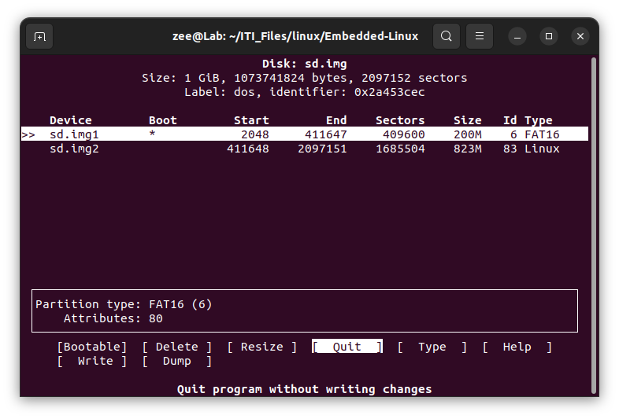
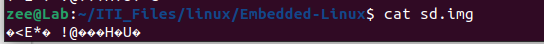

## Virtual SD Card for Emb-Linux

#### Q1: Create a 1 GiB Virtual Disk Image and explain the command you use.

to create the virtual SD card:

1. `touch sd.img`

   : create a file.

2. `dd if= /dev/zero of=/sd.img bs=iM count=1024`

   : run the file /dev/zero (which infinitely print "^@"==nothing ) and redirect it to 'sd.img' file to fill 1MB * 1024 time -> this will make the file  take 1GB size.

#### Q2: Define what is the difference between the DOS/MBR and GPT partition scheme/type.

GPT (GUID Partition Table) is the modern standard for disk partitioning:

​	supporting drives larger than 2TB (up to 9.4ZB), over 128 partitions, 64-bit disk sector, and UEFI (Unified Extensible Firmware Interface) -faster & more secure booting-

MBR (Master Boot Record) is an older, limited standard:

​	restricted to 2TB, 4 primary partitions, 64-bit disk sector, and legacy BIOS

#### Q3: Define what is the difference between different File systems and Its usage (FAT16, FAT32, and EXT4)

Comparison Summary Table

| Feature           | FAT16                   | FAT32                  | EXT4                |
| ----------------- | ----------------------- | ---------------------- | ------------------- |
| **Max File Size** | 2 GB (4GB with LFS)     | 4 GB                   | 16 TB               |
| **Max Vol Size**  | 2 GB - 4 GB             | 8 TB - 16 TB           | 1 EiB               |
| **Journaling**    | No                      | No                     | Yes                 |
| **Compatibility** | Extremely High (Legacy) | Very High (Universal)  | Linux Only (Native) |
| **Performance**   | Low                     | Low/Moderate           | High                |
| **Ideal Use**     | Older Cameras/Embedded  | USB/SD Cards (Sharing) | Linux System/Data   |

#### Q4: Formatting and Partition the Virtual Disk Image.

3. `cfdisk sd.img`

   : display or manipulate a disk partition table to 

   	- chose DOS == MBR --> to create the MBR section in the virtual SD card.

    - divide the full memory into two partitions 
      - 200M + bootable + FAT16
      -  rest of the available space + EXT4

   

   this next photo prove that the MBR was written.

   

#### Q5: Define what is the Loop Devices, why Linux use them.

	##### a. Command to create a loop device

4. `losetup -f --partscan --show sd.img`

   : set up and attach Virtual Disk Image as a Loop Device

   

##### b. Command to list all loop devices currently in use.

​	`lsblk`

##### c. Command to detach a (Mounted)loop device

​	`sudo unmount /home/zee/ITI_Files/linux/Embedded-Linux/sd.img`	[==mounting point]

​	`losetup -d /dev/loop16`

#### Q6: How can you check the current loop device limit?

#### Q7: Can you expand the number of loop devices in Linux ?

#### Q8: Attach the Virtual Disk Image as a Loop Device.

#### Q9: Format the Virtual Disk Image Partitions “Explain the command you use”

##### a. First primary partition (Boot partition → FAT16, label "boot")

5. `sudo mkfs.vfat -F 16 -n boot  /dev/loop16p1`

   

##### b. Second primary partition (ext4, label "rootfs")

6. `sudo mkfs.ext4 -L rootfs  /dev/loop16p2`

   other infos was written in the sd.img, which is displayed on the terminal after a delay as they was saved in partition 2 in the loop device 

##### Q10: Explain what you Know about the “mount” and “unmount” Linux Command.

these commands are used with the external device connected on the system. to tell the kernal this device is connected and stable use "mount" so it would be able to read, write and execute files on this device. where if this device is no longer needed use "unmount" to tell the kernal to detached this device and make sure that no one is needing it now and all its content is fully updated without any forgotten chunks in the cash memory.

##### Q11: What is the difference between the block device vs character device.

block device is a memory block that support random access

where character device is for streaming characters (like: keyboards, serial ports)

**Comparison Table:**

| Feature            | Block Device            | Character Device             |
| ------------------ | ----------------------- | ---------------------------- |
| **Data Unit**      | Blocks (Fixed size)     | Characters/Bytes             |
| **Access**         | Random                  | Sequential                   |
| **Buffering**      | Yes (Cached)            | No (Raw)                     |
| **Speed**          | Faster (due to caching) | Slower                       |
| **Examples**       | HDD, SSD, USB Drive     | Keyboard, Mouse, Serial Port |
| **`ls -l` prefix** | `b`                     | `c`                          |

##### Q12: Create Mount Points and Mount the Virtual Disk Image Partitions.

`mkdir boot`

`mount /dev/loop16p1 boot`