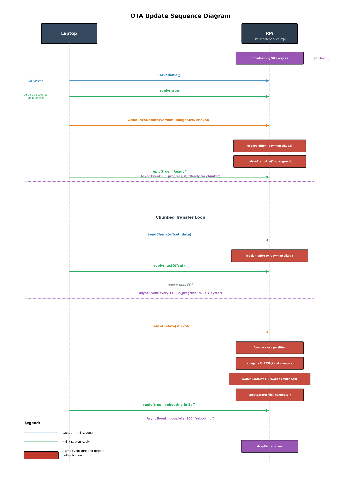
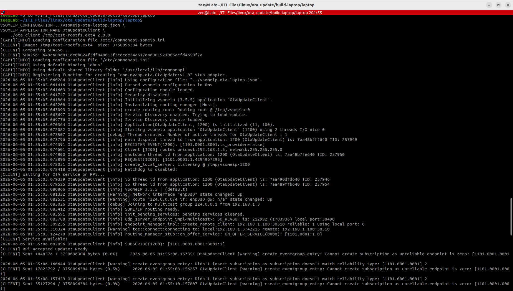
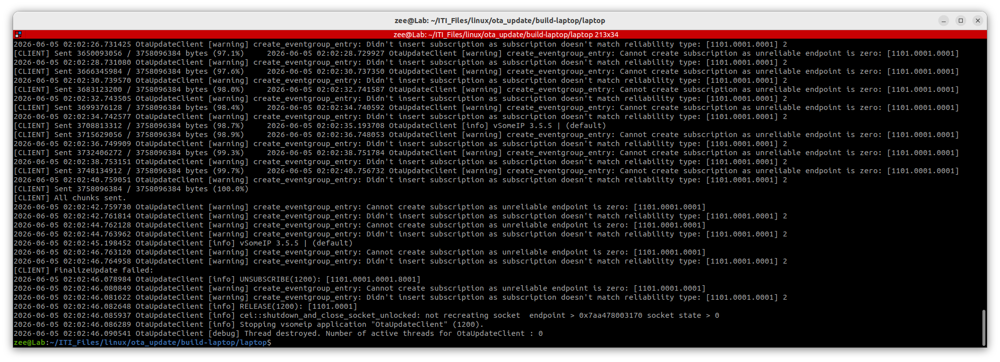
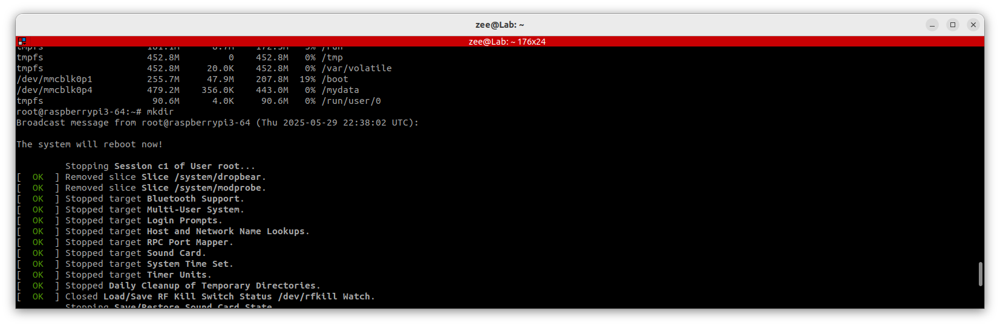
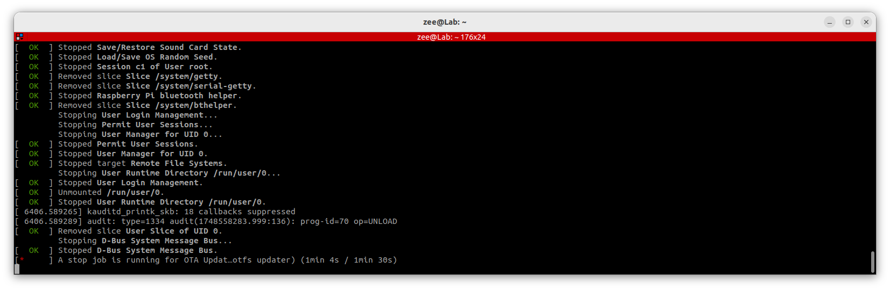
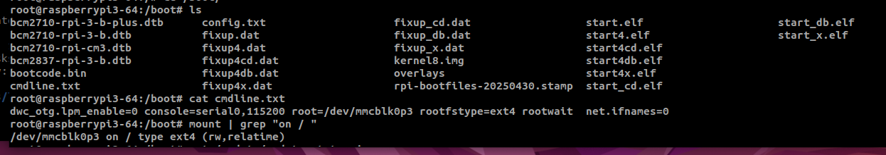
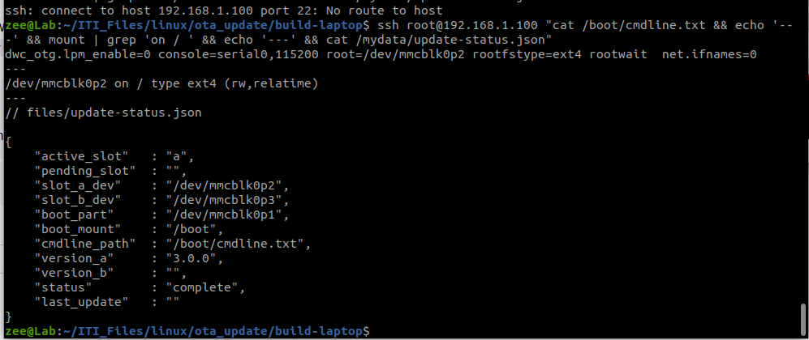

### to run the ready some/ip example:

Then restart both sides — **RPi first, laptop second:**

**RPi:**

```bash
export VSOMEIP_CONFIGURATION=/etc/vsomeip/vsomeip-test.json
export VSOMEIP_APPLICATION_NAME=notify-sample
notify-sample
```

**Laptop:**

```bash
export VSOMEIP_CONFIGURATION=/tmp/vsomeip-laptop.json
export VSOMEIP_APPLICATION_NAME=subscribe-sample
/home/zee/ITI_Files/linux/vsomeip_commonapi_libs/vsomeip/build/examples/subscribe-sample
```


# OTA update laptob & rpi 3 b+


### Phase 1: Service Discovery

The RPi runs `OtaUpdateServiceImpl` which continuously broadcasts its availability via **multicast** every 2 seconds. The Laptop discovers this service and builds a proxy object to communicate with it.

### Phase 2: Update Announcement

The Laptop initiates the update by calling `AnnounceUpdate()` with three critical pieces of metadata:

- **`version`**: Identifies which firmware version is being pushed
- **`imageSize`**: Total bytes expected (used for progress tracking)
- **`sha256`**: Cryptographic hash of the *entire* image for integrity verification

The RPi responds by:

1. Opening the target partition (`/dev/mmcblk0p3`) — this is the **inactive/boot partition** where the new image will be written
2. Writing `"in_progress"` to a status file (crash-recovery marker)
3. Replying `true` with `"Ready"` — signaling it can receive chunks

### Phase 3: Chunked Transfer

The image is too large to send in one RPC call, so it's broken into chunks. The loop works as follows:

- **Laptop** sends `SendChunk(offset, data)` — each chunk carries its byte offset and payload
- **RPi** uses `lseek` to position the write pointer, then writes to the raw block device
- **RPi** replies with `nextOffset` — the expected offset for the next chunk (acts as an implicit ACK)

This continues until the Laptop reaches EOF (End of File).

### Phase 4: Finalization & Atomic Switch

Once all chunks arrive, the Laptop calls `FinalizeUpdate(sha256)`:

1. **`fsync` + `close`** — forces all buffered writes to disk
2. **`computeSHA256()`** — the RPi independently hashes the written image
3. **Compare** — if the hash doesn't match the announced SHA256, the update aborts
4. **`switchBootSlot()`** — rewrites `cmdline.txt` to point the bootloader to `/dev/mmcblk0p3` on next boot
5. **Status file updated** to `"complete"`
6. Reply: `true, "rebooting in 5s"`
7. **Sleep 5s → reboot** — gives the Laptop time to receive the final reply

### Async Events (One-way, Not Awaited)

These are **fire-and-forget** status notifications from RPi → Laptop:

- `(in_progress, 0, "Ready for chunks")` — right after `AnnounceUpdate` is accepted
- `(in_progress, N, "X/Y bytes")` — every 1% of total bytes transferred
- `(complete, 100, "rebooting")` — after finalization succeeds
- `(failed, 0, "reason")` — on any error (hash mismatch, write failure, etc.)

------




### How to build — laptop (right now, native)

```bash
cd ~/ITI_Files/linux/ota_update
mkdir build-laptop && cd build-laptop

cd ~/ITI_Files/linux/ota_update/build-laptop
rm -rf *
cmake .. -DBUILD_TARGET=laptop -DCAPI_PREFIX=/usr/local
make -j$(nproc)

# add multicast route to your laptop's network config
sudo ip route add 224.0.0.0/4 dev enp3s0

# go to ship every rpi file after bitbake:
# it is shown in the next topic

#   then come here to contionue

# Run with the vsomeip config pointed at the right file:
cd ~/ITI_Files/linux/ota_update/build-laptop/laptop
VSOMEIP_CONFIGURATION=../vsomeip-ota-laptop.json \
VSOMEIP_APPLICATION_NAME=OtaUpdateClient \
    ./ota_client /tmp/test-rootfs.ext4 2.0.0
```

### Ship everything to the RPi after "bitbake"

on rpi:

```bash
# make sure rpi has its ip
ip addr add 192.168.1.100/24 dev eth0
```

on the lap:

```bash
SYSROOT=~/ITI_Files/linux/yocto/shared_build/tmp/work/cortexa53-poky-linux/ota-update-agent/1.0/image
RPI=root@192.168.1.100

# Binary
scp $SYSROOT/usr/bin/ota_update_service $RPI:/usr/bin/

# vsomeip config
scp $SYSROOT/etc/vsomeip/vsomeip-ota.json $RPI:/etc/vsomeip/

# systemd unit
scp $SYSROOT/usr/lib/systemd/system/ota-update-agent.service $RPI:/usr/lib/systemd/system/

# Reload and start
ssh $RPI "systemctl daemon-reload && systemctl enable ota-update-agent && systemctl start ota-update-agent"
```

### Verify it's running on the RPi

bash

```bash
ssh root@192.168.1.100 "systemctl status ota-update-agent"
ssh root@192.168.1.100 "journalctl -u ota-update-agent -f"
```

You should see:

```
[OTA] Starting OTA Update Service...
[OTA] Service registered. Waiting for laptop...
```

### on your lap

```bash
ssh root@192.168.1.100 "cat /boot/cmdline.txt && echo '---' && mount | grep 'on / ' && echo '---' && cat /mydata/update-status.json"
```

## on the lap:





## on the rpi:

rebooting





cmdline.txt is on partition **/dev/mmcblk0p3** (where the old one was **/dev/mmcblk0p2**)




it can do both rootfs-a to rootfs-b and rootfs-b to rootfs-a, here is after switching **back to rootfs-a**:



# lap and qnx


```bash
echo "[OTA-GW] Creating staging directory..."
mkdir -p /var/ota_staging

echo "[OTA-GW] Starting OTA gateway..."
export LD_LIBRARY_PATH=/system/usr/lib:/usr/lib:$LD_LIBRARY_PATH

VSOMEIP_CONFIGURATION=/system/etc/vsomeip/vsomeip-ota-qnx.json \
VSOMEIP_APPLICATION_NAME=OtaGateway \
    /system/usr/bin/ota-gateway &
```


# lap, qnx and yocto

## Auto-discovery of QNX IP — Yes, feasible

Two practical options:

**— mDNS/hostname (simplest)** QNX already has a hostname `qnxpi`. If your router supports mDNS:

```bash
ping qnxpi.local
ping raspberrypi3-64.local
```

If that resolves, use `qnxpi.local` instead of an IP — done, no scanning needed.

```bash
ssh root@qnxpi.local
ssh root@raspberrypi3-64.local
```


**Step 1 — Get a test image on the laptop**

bash

```bash
# On the laptop — pull the current rootfs-a as the test image
# (we'll send it back as "v2.0.0" to slot B — same content, just testing the pipe)
ssh root@raspberrypi3-64.local "dd if=/dev/mmcblk0p2 bs=4M" |     dd of=/home/zee/ITI_Files/linux/ota_update/test-rootfs.ext4 bs=4M status=progress
# or
ssh root@192.168.97.153 "dd if=/dev/mmcblk0p2 bs=4M" | \
    dd of=/home/zee/ITI_Files/linux/ota_update/test-rootfs.ext4 bs=4M status=progress
```


# Commands to run the full three-system test AUTOMATIC

```bash
cd ~/ITI_Files/linux/ota_update/laptop-app/python
# Send the update
python3 send_update.py \
    /home/zee/ITI_Files/linux/ota_update/test-rootfs.ext4 \
    qnxpi.local
```

on qnx:
```bash
echo "[OTA-GW] Creating staging directory..."
mkdir -p /var/ota_staging

echo "[OTA-GW] Exporting some variables..."
export LD_LIBRARY_PATH=/system/usr/lib:/usr/lib:$LD_LIBRARY_PATH
export VSOMEIP_CONFIGURATION=/system/etc/vsomeip/vsomeip-ota-qnx.json
export VSOMEIP_APPLICATION_NAME=OtaGateway

echo "[OTA-GW] Starting OTA gateway..."
/system/usr/bin/ota-gateway &
```


## Commands to run the full three-system test MANULA

**Terminal 1 — Watch Yocto live:**

```bash
journalctl -u ota-update-agent -f
```

```bash
ssh root@192.168.1.100 "journalctl -u ota-update-agent -f"
```

**Terminal 2 — Watch QNX gateway live:**

```bash
ssh root@qnxpi.local "tail -f /var/log/ota-gateway.log"
# or if no log file yet:
ssh root@qnxpi.local "/system/usr/bin/ota-gateway"
```

**Terminal 3 — Send update from laptop:**

```bash
# Auto-find QNX IP
QNX_IP=$(sudo arp-scan --interface=enp3s0 --localnet 2>/dev/null \
         | grep "88:a2:9e" | awk '{print $1}')
echo "QNX found at: $QNX_IP"

# Add multicast route (needed for SOME/IP between QNX and Yocto)
# This runs on QNX side — do it once via SSH if not in post_start yet
ssh root@$QNX_IP "route add -net 224.0.0.0/4 cgem0"

# Send the update
python3 ~/ITI_Files/linux/ota_update/send_update.py \
    /tmp/test-rootfs.ext4 \
    $QNX_IP
```

**Also on Yocto — make sure multicast route exists on eth0:**

```bash
ssh root@192.168.50.50 "ip route add 224.0.0.0/4 dev eth0 2>/dev/null || true"
```

